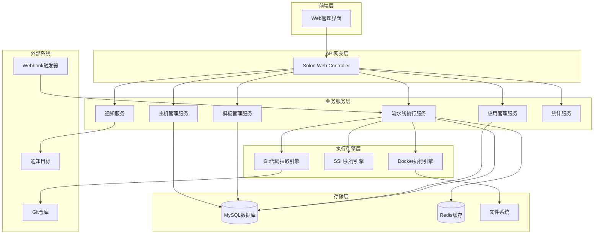
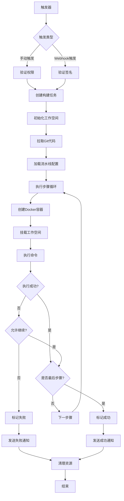

# Docker容器DevOps平台设计文档

## 概述

基于Solon框架开发的Docker容器化自动化部署平台，核心理念是通过容器环境对项目进行编译、打包、构建镜像和启动等操作。平台支持手动触发和Webhook自动触发，提供完整的CI/CD流水线管理功能。

### 核心特性
- 基于Docker容器的编译构建环境
- 支持本地和远程主机部署
- 灵活的流水线步骤配置
- Git仓库集成和分支管理
- 消息通知系统
- 统计监控功能

## 技术架构

### 技术栈
- **后端框架**: Solon 1.12.x
- **容器运行时**: Docker Engine
- **数据库**: MySQL 8.0+
- **缓存**: 本地缓存
- **SSH客户端**: JSch
- **Git客户端**: JGit

### 系统架构图



## 核心模块设计

### 主机管理模块

#### 数据模型
```yaml
Host:
  id: Long
  name: String          # 主机名称
  hostIp: String        # 主机IP地址
  port: Integer         # SSH端口，默认22
  username: String      # SSH用户名
  password: String      # SSH密码(加密存储)
  privateKey: String    # SSH私钥(可选)
  status: HostStatus    # 主机状态：ONLINE/OFFLINE/ERROR
  description: String   # 主机描述
  createTime: LocalDateTime
  updateTime: LocalDateTime
```

#### 核心功能
- 主机信息的增删改查
- SSH连接测试
- 主机状态监控
- 批量主机操作

#### API接口设计
```java
@Controller
@Mapping("/api/hosts")
public class HostController {
    
    @Mapping(value = "", method = MethodType.GET)
    public Result<PageResult<Host>> listHosts(@Param int page, @Param int size);
    
    @Mapping(value = "", method = MethodType.POST)
    public Result<Host> createHost(@Body Host host);
    
    @Mapping(value = "/{id}", method = MethodType.PUT)
    public Result<Host> updateHost(@Path Long id, @Body Host host);
    
    @Mapping(value = "/{id}", method = MethodType.DELETE)
    public Result<Void> deleteHost(@Path Long id);
    
    @Mapping(value = "/{id}/test", method = MethodType.POST)
    public Result<Boolean> testConnection(@Path Long id);
}
```

### 模板管理模块

#### 数据模型
```yaml
Template:
  id: Long
  name: String          # 模板名称
  type: TemplateType    # 模板类型：SPRINGBOOT/VUE/REACT/STATIC等
  description: String   # 模板描述
  steps: List<Step>     # 执行步骤列表
  createTime: LocalDateTime
  updateTime: LocalDateTime

Step:
  id: Long
  templateId: Long      # 关联模板ID
  name: String          # 步骤名称
  image: String         # Docker镜像名
  commands: List<String> # 执行命令列表
  order: Integer        # 执行顺序
  continueOnError: Boolean # 出错是否继续
```

#### 预置模板示例

**Spring Boot项目模板**
```yaml
steps:
  - name: "Maven编译打包"
    image: "maven:3.8-openjdk-11"
    commands:
      - "mvn clean package -DskipTests=true"
  
  - name: "构建Docker镜像"
    image: "docker:20.10"
    commands:
      - "docker build -t ${APP_NAME}:${BUILD_NUMBER} ."
  
  - name: "启动应用容器"
    image: "docker:20.10"
    commands:
      - "docker stop ${APP_NAME} || true"
      - "docker rm ${APP_NAME} || true"
      - "docker run -d --name ${APP_NAME} -p ${APP_PORT}:8080 ${APP_NAME}:${BUILD_NUMBER}"
```

**Vue项目模板**
```yaml
steps:
  - name: "Node环境构建"
    image: "node:16-alpine"
    commands:
      - "npm install"
      - "npm run build"
  
  - name: "Nginx镜像打包"
    image: "docker:20.10"
    commands:
      - "docker build -t ${APP_NAME}:${BUILD_NUMBER} -f Dockerfile.nginx ."
  
  - name: "启动Nginx容器"
    image: "docker:20.10"
    commands:
      - "docker stop ${APP_NAME} || true"
      - "docker rm ${APP_NAME} || true"
      - "docker run -d --name ${APP_NAME} -p ${APP_PORT}:80 ${APP_NAME}:${BUILD_NUMBER}"
```

### 应用管理模块

#### 数据模型
```yaml
Application:
  id: Long
  name: String              # 应用名称
  gitRepoUrl: String        # Git仓库地址
  gitBranch: String         # Git分支
  gitCredentials: String    # Git凭证(加密存储)
  templateId: Long          # 关联模板ID
  hostIds: List<Long>       # 目标主机ID列表
  variables: Map<String, String> # 环境变量
  notificationUrl: String   # 通知地址
  notificationToken: String # 通知令牌
  autoTrigger: Boolean      # 是否自动触发
  webhookSecret: String     # Webhook密钥
  status: AppStatus         # 应用状态
  createTime: LocalDateTime
  updateTime: LocalDateTime

PipelineConfig:
  id: Long
  applicationId: Long       # 关联应用ID
  steps: List<PipelineStep> # 流水线步骤
  createTime: LocalDateTime
  updateTime: LocalDateTime

PipelineStep:
  id: Long
  configId: Long           # 关联配置ID
  name: String             # 步骤名称
  image: String            # Docker镜像
  commands: List<String>   # 执行命令
  order: Integer           # 执行顺序
  continueOnError: Boolean # 出错是否继续
  workDir: String          # 工作目录
  environment: Map<String, String> # 环境变量
```

#### 流水线配置数据结构
```json
{
  "applicationId": 1,
  "steps": [
    {
      "name": "代码拉取",
      "image": "alpine/git:latest",
      "commands": [
        "git clone ${GIT_REPO_URL} /workspace",
        "cd /workspace && git checkout ${GIT_BRANCH}"
      ],
      "order": 1,
      "continueOnError": false,
      "workDir": "/",
      "environment": {
        "GIT_REPO_URL": "${application.gitRepoUrl}",
        "GIT_BRANCH": "${application.gitBranch}"
      }
    },
    {
      "name": "Maven编译",
      "image": "maven:3.8-openjdk-11",
      "commands": [
        "mvn clean package -DskipTests=true"
      ],
      "order": 2,
      "continueOnError": false,
      "workDir": "/workspace",
      "environment": {}
    },
    {
      "name": "Docker镜像构建",
      "image": "docker:20.10",
      "commands": [
        "docker build -t ${APP_NAME}:${BUILD_NUMBER} ."
      ],
      "order": 3,
      "continueOnError": false,
      "workDir": "/workspace",
      "environment": {
        "APP_NAME": "${application.name}",
        "BUILD_NUMBER": "${build.number}"
      }
    }
  ]
}
```

### 流水线执行引擎

#### 执行流程设计



#### 核心执行服务
```java
@Service
public class PipelineExecutionService {
    
    public CompletableFuture<BuildResult> execute(Long applicationId, String triggeredBy) {
        return CompletableFuture.supplyAsync(() -> {
            try {
                // 1. 创建构建上下文
                BuildContext context = createBuildContext(applicationId, triggeredBy);
                
                // 2. 初始化工作空间
                initWorkspace(context);
                
                // 3. 拉取代码
                pullSourceCode(context);
                
                // 4. 执行流水线步骤
                executeSteps(context);
                
                // 5. 部署到目标主机
                deployToHosts(context);
                
                // 6. 发送成功通知
                sendNotification(context, BuildStatus.SUCCESS);
                
                return BuildResult.success(context);
                
            } catch (Exception e) {
                log.error("Pipeline execution failed", e);
                sendNotification(context, BuildStatus.FAILED);
                return BuildResult.failed(e.getMessage());
            } finally {
                // 清理工作空间
                cleanupWorkspace(context);
            }
        }, executorService);
    }
    
    private void executeSteps(BuildContext context) {
        List<PipelineStep> steps = context.getPipelineConfig().getSteps();
        
        for (PipelineStep step : steps) {
            try {
                log.info("Executing step: {}", step.getName());
                
                // 创建Docker容器并执行命令
                ContainerResult result = dockerEngine.runContainer(
                    step.getImage(),
                    step.getCommands(),
                    context.getWorkspacePath(),
                    step.getEnvironment()
                );
                
                if (!result.isSuccess() && !step.isContinueOnError()) {
                    throw new PipelineExecutionException(
                        "Step failed: " + step.getName() + ", Error: " + result.getError()
                    );
                }
                
                context.addStepResult(step, result);
                
            } catch (Exception e) {
                if (!step.isContinueOnError()) {
                    throw new PipelineExecutionException("Step execution failed: " + step.getName(), e);
                }
                log.warn("Step failed but continuing: {}", step.getName(), e);
            }
        }
    }
}
```

### 通知服务模块

#### 通知类型支持
- HTTP Webhook通知
- 邮件通知
- 企业微信/钉钉通知
- Slack通知

#### 通知消息格式
```json
{
  "eventType": "BUILD_COMPLETED",
  "application": {
    "id": 1,
    "name": "demo-app",
    "gitBranch": "main"
  },
  "build": {
    "id": 123,
    "number": 15,
    "status": "SUCCESS",
    "duration": 180,
    "triggeredBy": "webhook",
    "startTime": "2024-01-15T10:30:00Z",
    "endTime": "2024-01-15T10:33:00Z"
  },
  "steps": [
    {
      "name": "Maven编译",
      "status": "SUCCESS",
      "duration": 120
    },
    {
      "name": "Docker构建",
      "status": "SUCCESS", 
      "duration": 60
    }
  ]
}
```

### 统计监控模块

#### 统计数据模型
```yaml
Statistics:
  totalApplications: Long     # 应用总数
  totalBuilds: Long          # 构建总次数
  successfulBuilds: Long     # 成功构建次数
  failedBuilds: Long         # 失败构建次数
  totalNotifications: Long   # 通知总次数
  averageBuildDuration: Double # 平均构建时长
  lastUpdateTime: LocalDateTime

BuildMetrics:
  applicationId: Long
  date: LocalDate
  buildCount: Integer        # 当日构建次数
  successCount: Integer      # 当日成功次数
  failedCount: Integer       # 当日失败次数
  avgDuration: Double        # 当日平均时长
```

#### 监控大屏数据API
```java
@Controller
@Mapping("/api/statistics")
public class StatisticsController {
    
    @Mapping("/dashboard")
    public Result<DashboardData> getDashboardData() {
        return Result.success(statisticsService.getDashboardData());
    }
    
    @Mapping("/trends")
    public Result<List<BuildTrend>> getBuildTrends(@Param int days) {
        return Result.success(statisticsService.getBuildTrends(days));
    }
    
    @Mapping("/applications/{id}/metrics")
    public Result<ApplicationMetrics> getApplicationMetrics(@Path Long id) {
        return Result.success(statisticsService.getApplicationMetrics(id));
    }
}
```

## 数据库设计

### 核心数据表

```sql
-- 主机管理表
CREATE TABLE hosts (
    id BIGINT PRIMARY KEY AUTO_INCREMENT,
    name VARCHAR(100) NOT NULL,
    host_ip VARCHAR(50) NOT NULL,
    port INT DEFAULT 22,
    username VARCHAR(50) NOT NULL,
    password VARCHAR(255),
    private_key TEXT,
    status VARCHAR(20) DEFAULT 'OFFLINE',
    description TEXT,
    create_time DATETIME DEFAULT CURRENT_TIMESTAMP,
    update_time DATETIME DEFAULT CURRENT_TIMESTAMP ON UPDATE CURRENT_TIMESTAMP
);

-- 模板管理表
CREATE TABLE templates (
    id BIGINT PRIMARY KEY AUTO_INCREMENT,
    name VARCHAR(100) NOT NULL,
    type VARCHAR(50) NOT NULL,
    description TEXT,
    create_time DATETIME DEFAULT CURRENT_TIMESTAMP,
    update_time DATETIME DEFAULT CURRENT_TIMESTAMP ON UPDATE CURRENT_TIMESTAMP
);

-- 模板步骤表
CREATE TABLE template_steps (
    id BIGINT PRIMARY KEY AUTO_INCREMENT,
    template_id BIGINT NOT NULL,
    name VARCHAR(100) NOT NULL,
    image VARCHAR(200) NOT NULL,
    commands TEXT NOT NULL,
    step_order INT NOT NULL,
    continue_on_error BOOLEAN DEFAULT FALSE,
    FOREIGN KEY (template_id) REFERENCES templates(id) ON DELETE CASCADE
);

-- 应用管理表
CREATE TABLE applications (
    id BIGINT PRIMARY KEY AUTO_INCREMENT,
    name VARCHAR(100) NOT NULL,
    git_repo_url VARCHAR(500) NOT NULL,
    git_branch VARCHAR(100) DEFAULT 'main',
    git_credentials TEXT,
    template_id BIGINT,
    notification_url VARCHAR(500),
    notification_token VARCHAR(255),
    auto_trigger BOOLEAN DEFAULT FALSE,
    webhook_secret VARCHAR(255),
    status VARCHAR(20) DEFAULT 'ACTIVE',
    create_time DATETIME DEFAULT CURRENT_TIMESTAMP,
    update_time DATETIME DEFAULT CURRENT_TIMESTAMP ON UPDATE CURRENT_TIMESTAMP,
    FOREIGN KEY (template_id) REFERENCES templates(id)
);

-- 流水线配置表
CREATE TABLE pipeline_configs (
    id BIGINT PRIMARY KEY AUTO_INCREMENT,
    application_id BIGINT NOT NULL,
    config_json TEXT NOT NULL,
    create_time DATETIME DEFAULT CURRENT_TIMESTAMP,
    update_time DATETIME DEFAULT CURRENT_TIMESTAMP ON UPDATE CURRENT_TIMESTAMP,
    FOREIGN KEY (application_id) REFERENCES applications(id) ON DELETE CASCADE
);

-- 构建记录表
CREATE TABLE builds (
    id BIGINT PRIMARY KEY AUTO_INCREMENT,
    application_id BIGINT NOT NULL,
    build_number INT NOT NULL,
    status VARCHAR(20) NOT NULL,
    triggered_by VARCHAR(50),
    start_time DATETIME,
    end_time DATETIME,
    duration_seconds INT,
    log_file_path VARCHAR(500),
    create_time DATETIME DEFAULT CURRENT_TIMESTAMP,
    FOREIGN KEY (application_id) REFERENCES applications(id)
);

-- 构建步骤记录表
CREATE TABLE build_steps (
    id BIGINT PRIMARY KEY AUTO_INCREMENT,
    build_id BIGINT NOT NULL,
    step_name VARCHAR(100) NOT NULL,
    step_order INT NOT NULL,
    status VARCHAR(20) NOT NULL,
    start_time DATETIME,
    end_time DATETIME,
    duration_seconds INT,
    log_content TEXT,
    error_message TEXT,
    FOREIGN KEY (build_id) REFERENCES builds(id) ON DELETE CASCADE
);

-- 统计数据表
CREATE TABLE build_metrics (
    id BIGINT PRIMARY KEY AUTO_INCREMENT,
    application_id BIGINT,
    metric_date DATE NOT NULL,
    build_count INT DEFAULT 0,
    success_count INT DEFAULT 0,
    failed_count INT DEFAULT 0,
    avg_duration DECIMAL(10,2) DEFAULT 0,
    create_time DATETIME DEFAULT CURRENT_TIMESTAMP,
    UNIQUE KEY uk_app_date (application_id, metric_date)
);
```

## API接口设计

### Webhook接口
```java
@Controller
@Mapping("/api/webhook")
public class WebhookController {
    
    @Mapping(value = "/gitee/{appId}", method = MethodType.POST)
    public Result<Void> handleGiteeWebhook(
        @Path Long appId,
        @Header("X-Gitee-Event") String event,
        @Header("X-Gitee-Signature") String signature,
        @Body String payload
    ) {
        // 验证签名
        if (!webhookService.verifyGiteeSignature(appId, signature, payload)) {
            throw new UnauthorizedException("Invalid webhook signature");
        }
        
        // 处理推送事件
        if ("push".equals(event)) {
            webhookService.handlePushEvent(appId, payload);
        }
        
        return Result.success();
    }
}
```

### 构建管理接口
```java
@Controller
@Mapping("/api/builds")
public class BuildController {
    
    @Mapping(value = "/trigger/{appId}", method = MethodType.POST)
    public Result<BuildInfo> triggerBuild(@Path Long appId) {
        BuildInfo build = buildService.triggerManualBuild(appId);
        return Result.success(build);
    }
    
    @Mapping(value = "/{buildId}/status")
    public Result<BuildStatus> getBuildStatus(@Path Long buildId) {
        BuildStatus status = buildService.getBuildStatus(buildId);
        return Result.success(status);
    }
    
    @Mapping(value = "/{buildId}/logs")
    public Result<String> getBuildLogs(@Path Long buildId) {
        String logs = buildService.getBuildLogs(buildId);
        return Result.success(logs);
    }
    
    @Mapping(value = "/{buildId}/cancel", method = MethodType.POST)
    public Result<Void> cancelBuild(@Path Long buildId) {
        buildService.cancelBuild(buildId);
        return Result.success();
    }
}
```

## 部署架构

### Docker Compose部署配置
```yaml
version: '3.8'
services:
  devops-platform:
    build: .
    ports:
      - "8080:8080"
    environment:
      - SPRING_PROFILES_ACTIVE=prod
      - MYSQL_HOST=mysql
      - REDIS_HOST=redis
      - RABBITMQ_HOST=rabbitmq
    volumes:
      - /var/run/docker.sock:/var/run/docker.sock
      - ./workspace:/app/workspace
    depends_on:
      - mysql
      - redis
      - rabbitmq
    networks:
      - devops-network

  mysql:
    image: mysql:8.0
    environment:
      - MYSQL_ROOT_PASSWORD=root123
      - MYSQL_DATABASE=devops_platform
    volumes:
      - mysql_data:/var/lib/mysql
    networks:
      - devops-network

  redis:
    image: redis:6.2-alpine
    networks:
      - devops-network

  rabbitmq:
    image: rabbitmq:3.9-management
    environment:
      - RABBITMQ_DEFAULT_USER=admin
      - RABBITMQ_DEFAULT_PASS=admin123
    ports:
      - "15672:15672"
    networks:
      - devops-network

volumes:
  mysql_data:

networks:
  devops-network:
    driver: bridge
```

### 安全考虑
- Docker Socket安全访问控制
- SSH密钥加密存储
- Webhook签名验证
- API访问权限控制
- 容器资源限制
- 日志敏感信息脱敏

## 测试策略

### 单元测试
```java
@SolonTest(App.class)
public class PipelineExecutionServiceTest {
    
    @Inject
    private PipelineExecutionService pipelineService;
    
    @Test
    public void testExecuteSimplePipeline() {
        // 准备测试数据
        Application app = createTestApplication();
        PipelineConfig config = createTestPipelineConfig();
        
        // 执行测试
        CompletableFuture<BuildResult> future = pipelineService.execute(app.getId(), "test");
        BuildResult result = future.join();
        
        // 验证结果
        assertThat(result.isSuccess()).isTrue();
        assertThat(result.getBuildId()).isNotNull();
    }
}
```

### 集成测试
- Docker容器执行测试
- SSH连接测试
- Git仓库拉取测试
- Webhook接收测试
- 通知发送测试

### 性能测试
- 并发构建性能测试
- 大型项目构建测试
- 资源使用监控测试