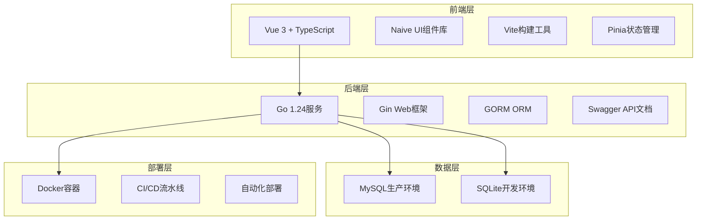

# CLAUDE.md

This file provides guidance to Claude Code (claude.ai/code) when working with code in this repository.

## 项目概述

这是一个企业级DevOps自动化部署平台，采用现代化的前后端分离架构。平台提供完整的主机管理、项目管理、自动化部署和容器化能力，支持CI/CD流水线集成。

## 技术架构

### 系统架构图



## 项目结构

```
DevOpsProject/
├── backend/                           # 后端服务
│   ├── cmd/
│   │   ├── main.go                   # 应用入口点
│   │   └── handlers.go               # HTTP请求处理器
│   ├── internal/                     # 内部包
│   │   ├── database/                 # 数据访问层
│   │   │   ├── database.go           # 数据库连接管理
│   │   │   ├── services.go           # 主机服务
│   │   │   ├── ssh.go                # SSH服务
│   │   │   ├── docker.go             # Docker服务
│   │   │   ├── project.go            # 项目服务
│   │   │   ├── deploy_config.go      # 部署配置服务
│   │   │   └── deploy_record.go      # 部署记录服务
│   │   └── models/                    # 数据模型
│   │       └── response.go           # 响应结构定义
│   ├── docs/                         # Swagger文档
│   ├── scripts/                      # 数据库脚本
│   ├── Dockerfile                    # Docker构建文件
│   ├── go.mod                        # Go模块定义
│   └── go.sum                        # 依赖版本锁定
├── apps/                             # 前端应用
│   └── web-naive/                    # 主前端应用
│       ├── src/
│       │   ├── views/                # 页面组件
│       │   │   └── devops/           # DevOps功能模块
│       │   │       ├── host/         # 主机管理
│       │   │       └── project/      # 项目管理
│       │   ├── api/                  # API调用封装
│       │   ├── router/               # 路由配置
│       │   └── store/                # 状态管理
│       ├── package.json
│       └── vite.config.mts
├── packages/                         # 共享包
│   ├── @vben/*                       # Vben框架包
│   ├── utils/                        # 工具包
│   ├── types/                        # 类型定义
│   └── styles/                       # 样式包
├── internal/                         # 内部工具
├── CLAUDE.md                          # 项目文档
└── README.md                          # 项目说明
```

## 用户要求

**前端所有的开发都基于 apps/web-naive目录**

## 核心功能模块

### 1. 主机管理模块

- **SSH连接管理**: 支持密码和密钥认证方式
- **主机状态监控**: 实时检测主机连通性
- **批量操作**: 支持批量主机状态检查
- **远程命令执行**: 通过SSH执行系统命令
- **文件传输**: 支持单文件和目录批量上传

### 2. 项目管理模块

- **项目信息管理**: 支持Git仓库集成
- **代码管理**: Git仓库地址和认证信息管理
- **项目编码**: 唯一性校验和自动补全
- **项目分类**: 支持多项目分类管理

### 3. 部署配置模块

- **环境配置**: 开发、测试、生产环境配置
- **分支管理**: 支持多分支部署策略
- **配置模板**: 可复用的部署配置模板
- **配置验证**: 配置参数有效性检查

### 4. 部署记录模块

- **部署历史**: 完整的部署记录追踪
- **状态管理**: running/success/failed状态
- **日志记录**: 详细的部署日志保存
- **统计分析**: 部署成功率统计

### 5. Docker集成模块

- **镜像构建**: 远程Docker镜像构建
- **容器管理**: 容器生命周期管理
- **环境信息**: Docker环境信息查询
- **批量操作**: 支持多主机Docker操作

## 技术栈详解

### 后端技术栈

- **Go 1.24**: 高性能后端开发语言
- **Gin v1.11**: 轻量级Web框架，高性能HTTP服务
- **GORM v1.25**: 强大的Go ORM库，支持多数据库
- **Swagger**: 自动化API文档生成
- **MySQL**: 生产环境主数据库
- **SQLite**: 开发环境轻量数据库
- **Docker**: 容器化部署

### 前端技术栈

- **Vue 3**: 渐进式JavaScript框架
- **TypeScript**: 类型安全的JavaScript超集
- **Naive UI**: 现代化Vue 3组件库
- **Vite**: 快速的前端构建工具
- **Pinia**: Vue 3官方推荐状态管理库
- **Vue Router**: Vue官方路由管理器
- **Vben Admin**: 企业级管理后台框架

### 开发工具

- **PNPM**: 高效的包管理器，支持Monorepo
- **Turbo**: Monorepo构建工具
- **ESLint**: 代码质量检查工具
- **Prettier**: 代码格式化工具
- **Playwright**: 端到端测试框架

## 数据库设计

### 核心数据表

#### hosts（主机表）

```sql
CREATE TABLE hosts (
    id INT AUTO_INCREMENT PRIMARY KEY,
    name VARCHAR(255) NOT NULL,                    -- 主机名称
    host VARCHAR(255) NOT NULL,                    -- IP地址
    port INT DEFAULT 22,                            -- SSH端口
    username VARCHAR(255) NOT NULL,                -- 用户名
    password VARCHAR(255) NOT NULL,                -- 密码
    auth_type VARCHAR(50) DEFAULT 'password',      -- 认证类型
    status VARCHAR(50) DEFAULT 'offline',          -- 状态
    remark TEXT,                                    -- 备注
    created_at DATETIME,                           -- 创建时间
    updated_at DATETIME,                           -- 更新时间
    deleted_at DATETIME                            -- 软删除时间
);
```

#### projects（项目表）

```sql
CREATE TABLE projects (
    id INT AUTO_INCREMENT PRIMARY KEY,
    name VARCHAR(255) NOT NULL,                    -- 项目名称
    code VARCHAR(100) NOT NULL UNIQUE,             -- 项目编码
    remark TEXT,                                    -- 备注
    git_repo VARCHAR(500),                         -- Git仓库地址
    git_username VARCHAR(255),                     -- Git用户名
    git_password VARCHAR(255),                     -- Git密码
    created_at DATETIME,                           -- 创建时间
    updated_at DATETIME,                           -- 更新时间
    deleted_at DATETIME                            -- 软删除时间
);
```

#### deploy_configs（部署配置表）

```sql
CREATE TABLE deploy_configs (
    id INT AUTO_INCREMENT PRIMARY KEY,
    project_id INT NOT NULL,                       -- 项目ID
    branch VARCHAR(255) NOT NULL,                  -- 分支名称
    config JSON,                                    -- 配置内容
    created_at DATETIME,                           -- 创建时间
    updated_at DATETIME,                           -- 更新时间
    deleted_at DATETIME,                           -- 软删除时间
);
```

#### deploy_records（部署记录表）

```sql
CREATE TABLE deploy_records (
    id INT AUTO_INCREMENT PRIMARY KEY,
    project_id INT NOT NULL,                       -- 项目ID
    project_name VARCHAR(255) NOT NULL,            -- 项目名称
    branch VARCHAR(255) NOT NULL,                  -- 分支
    start_time DATETIME NOT NULL,                  -- 开始时间
    duration BIGINT DEFAULT 0,                     -- 耗时（秒）
    log_path VARCHAR(500),                         -- 日志路径
    status VARCHAR(50) DEFAULT 'running',          -- 部署状态
    created_at DATETIME,                           -- 创建时间
    updated_at DATETIME,                           -- 更新时间
    deleted_at DATETIME                            -- 软删除时间
);
```

## API接口设计

### RESTful API规范

#### 主机管理API

```http
GET    /api/host                    # 获取主机列表（支持分页和查询）
POST   /api/host                    # 创建主机配置
GET    /api/host/:id                # 获取主机详情
PUT    /api/host/:id                # 更新主机配置
DELETE /api/host/:id                # 删除主机（软删除）

# SSH操作API
POST   /api/host/execute            # 执行SSH命令
POST   /api/host/:id/test           # 测试SSH连接
POST   /api/host/batch-check        # 批量检查主机状态
POST   /api/host/upload/file        # 上传单个文件
POST   /api/host/upload/directory  # 上传目录

# Docker管理API
POST   /api/host/docker/info        # 获取Docker信息
POST   /api/host/docker/build       # 构建Docker镜像
POST   /api/host/docker/run         # 运行Docker容器
POST   /api/host/docker/execute     # 执行Docker命令
```

#### 项目管理API

```http
GET    /api/project                 # 获取项目列表（支持分页和查询）
POST   /api/project                 # 创建项目
GET    /api/project/:id             # 获取项目详情
PUT    /api/project/:id             # 更新项目信息
DELETE /api/project/:id             # 删除项目
GET    /api/project/code/:code      # 根据编码获取项目
GET    /api/project/check-code      # 检查项目编码唯一性
```

### API响应格式

所有API采用统一的响应格式：

```json
{
  "code": 200, // 状态码：200成功，其他失败
  "message": "操作成功", // 响应消息
  "data": {
    // 响应数据
    // 具体数据内容
  }
}
```

## 常用开发命令

### 后端开发命令

```bash
# 进入后端目录
cd backend

# 安装依赖
go mod download

# 运行开发服务器
go run ./cmd/

# 编译项目
go build ./cmd/

# 生成Swagger文档
swag init -g cmd/main.go

# 运行测试
go test ./...

# 格式化代码
go fmt ./...

# 代码检查
go vet ./...

# Docker构建
docker build -t devops-platform .
```

### 前端开发命令

```bash
# 前端项目在根目录，无需切换目录

# 安装依赖
pnpm install

# 开发环境启动
pnpm dev                  # 启动所有应用
pnpm dev:naive           # 仅启动Naive UI应用

# 构建项目
pnpm build               # 构建所有项目
pnpm build:naive         # 仅构建Naive UI应用

# 代码检查和格式化
pnpm lint                # ESLint检查
pnpm format              # Prettier格式化
pnpm check:type          # TypeScript类型检查

# 测试
pnpm test:unit           # 单元测试

# 依赖管理
pnpm update              # 更新依赖
```

## 数据库配置

### 开发环境 (SQLite)

项目默认使用SQLite作为开发环境数据库，数据库文件为 `./devops.db`

### 生产环境 (MySQL)

生产环境使用MySQL，配置信息在 `backend/cmd/main.go`:

```go
config := database.Config{
    Type:     "mysql",
    Host:     "localhost",
    Port:     "3306",
    Database: "devops_platform",
    Username: "root",
    Password: "password",
}
```

## API端点

后端API服务运行在端口8080，主要端点：

- **Swagger文档**: `http://localhost:8080/swagger/index.html`
- **健康检查**: `GET /health`
- **项目管理**: `/api/project/*`
- **主机管理**: `/api/host/*`
- **部署配置**: `/api/deploy-config/*`
- **部署记录**: `/api/deploy-record/*`

## 容器化部署

### Docker构建

```bash
# 进入后端目录
cd backend

# 构建Docker镜像
docker build -t devops-platform .
```

### Docker运行

```bash
# 运行容器（端口8080）
docker run -p 8080:8080 devops-platform
```

### Docker Compose部署

```yaml
version: '3.8'
services:
  devops-platform:
    build: ./backend
    ports:
      - '8080:8080'
    environment:
      - DB_TYPE=mysql
      - DB_HOST=mysql
      - DB_PORT=3306
      - DB_NAME=devops_platform
      - DB_USER=root
      - DB_PASSWORD=password
    depends_on:
      - mysql
    restart: unless-stopped

  mysql:
    image: mysql:8.0
    environment:
      - MYSQL_ROOT_PASSWORD=password
      - MYSQL_DATABASE=devops_platform
    ports:
      - '3306:3306'
    volumes:
      - mysql_data:/var/lib/mysql
    restart: unless-stopped

volumes:
  mysql_data:
```

## 开发注意事项

1. **端口配置**:
   - 后端API: 8080 (开发/Docker统一)
   - 前端应用: 根据vite配置，通常在3000-4000范围

2. **数据库迁移**: 首次运行时会自动执行数据库表结构迁移

3. **CORS配置**: 开发环境已配置允许跨域访问，生产环境需要调整安全策略

4. **Monorepo管理**: 前端使用pnpm workspace，在根目录执行命令

5. **API文档更新**: 修改handlers.go中的Swagger注释后，需要重新运行 `swag init -g cmd/main.go` 生成文档

6. **环境配置**:
   - 开发环境API地址: `http://localhost:8080/api`
   - 生产环境根据实际部署环境配置

## 前端开发特定

### 应用访问

- **主应用**: apps/web-naive (用户指定的开发目录)
- **组件库**: packages/ 中的共享组件

### 路由配置

- DevOps模块路由: `apps/web-naive/src/router/routes/modules/devops.ts`
- **更新后的路由结构**:
  - 主机管理页面: `/host`
  - 项目管理页面: `/project`
  - 部署配置页面: `/deploy-config`
  - 部署记录页面: `/deploy-record`

### API服务集成

- 主机API: `apps/web-naive/src/api/host.ts`
- 项目API: `apps/web-naive/src/api/project.ts`
- 请求配置: `apps/web-naive/src/api/request.ts`

### Vxe Table架构学习成果

基于playground示例，已成功集成Vxe Table组件架构：

#### 标准CRUD页面结构

```
src/views/devops/[module]/
├── index.vue           # 主页面，使用VxeGrid
├── data.ts            # 表格列配置和表单字段定义
└── modules/
    └── form.vue       # 表单弹窗组件
```

#### 核心组件模式

1. **VxeGrid集成**: 使用`useVbenVxeGrid`钩子
   - 集成搜索表单配置 (`formOptions`)
   - 表格配置 (`gridOptions`)
   - 自动分页、排序、筛选功能

2. **表单配置**: 使用`useVbenForm`钩子
   - 字段验证规则 (基于zod)
   - 条件显示字段 (`dependencies`)
   - 统一的表单样式

3. **弹窗管理**: 使用`useVbenModal`钩子
   - 统一的弹窗逻辑
   - 数据传递和回调处理
   - 自动加载状态管理

#### 操作列标准定义

**推荐使用模板插槽方式**（更直观，易于维护）：

1. **表格列配置** (`data.ts`)：

```typescript
{
  align: 'center',
  field: 'action',
  fixed: 'right',
  headerAlign: 'center',
  showOverflow: false,
  title: '操作',
  width: 300,  // 固定宽度，确保按钮显示完整
  slots: { default: 'action' },
}
```

2. **模板插槽定义** (`index.vue`)：

```vue
<template #action="{ row }">
  <NFlex>
    <NButton type="info" size="small" @click="onTest(row)"> 测试连接 </NButton>
    <NButton type="warning" size="small" @click="onEdit(row)"> 编辑 </NButton>
    <NButton type="error" size="small" @click="onDelete(row)"> 删除 </NButton>
  </NFlex>
</template>
```

3. **事件处理函数** (`index.vue`)：

```typescript
function onTest(row: Host) {
  testConnection(row.id)
    .then(() => {
      console.log(`主机 "${row.name}" 连接成功`);
    })
    .catch(() => {
      console.error(`主机 "${row.name}" 连接失败`);
    });
}

function onEdit(row: Host) {
  formModalApi.setData(row).open();
}

function onDelete(row: Host) {
  deleteHost(row.id)
    .then(() => {
      refreshGrid();
    })
    .catch(() => {
      console.error(`主机 "${row.name}" 删除失败`);
    });
}
```

**配置式方式**（复杂场景备选）：

- 使用 `CellOperation` 渲染器
- 适用于需要动态生成按钮的复杂场景
- 配置较为复杂，维护成本高

#### 已重构模块

- **主机管理**: 完全重构为Vxe Table架构
  - 表格展示、搜索、分页
  - 主机创建/编辑表单
  - 操作按钮（测试连接、执行命令、上传文件、Docker管理、编辑、删除）

#### 开发规范

- 所有新功能模块必须遵循Vxe Table架构
- 统一使用`Page`组件包装
- 表单字段使用zod进行类型验证
- API调用遵循现有的接口规范
- 操作列优先使用模板插槽方式
- 操作列宽度建议设置为300px以确保按钮完整显示

## 测试和验证

### API测试

- Swagger UI: `http://localhost:8080/swagger/index.html`
- 健康检查: `http://localhost:8080/health`
- 主机管理API测试: 创建、查询、更新、删除主机
- 项目管理API测试: 创建、查询、更新、删除项目

### 功能验证

- SSH连接测试: 创建主机后测试SSH连通性
- 命令执行测试: 在主机上执行系统命令
- Docker功能测试: 获取Docker信息、执行Docker命令

## 部署验证

### 本地部署

- 后端服务启动成功 (端口8080)
- 数据库连接正常
- API接口响应正常
- Swagger文档可访问

### Docker部署

- 镜像构建成功
- 容器启动正常
- 服务可正常访问
- 数据持久化正常

---

## 联系方式

如有问题或建议，请联系开发团队或提交Issue。
