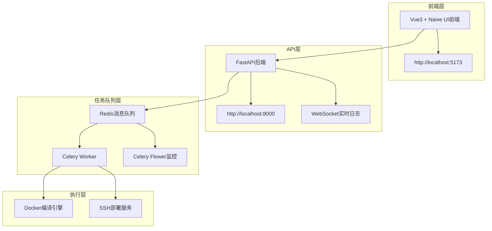

# CLAUDE.md

This file provides guidance to Claude Code (claude.ai/code) when working with code in this repository.

## 项目概述

**积木区DevOps (jimuqu-devops)** 是一个基于 **FastAPI + Celery + Docker + Vue3** 的现代化DevOps自动化部署平台，支持多语言项目的自动化编译、部署和监控。

**项目英文名**: jimuqu-devops
**项目中文名**: 积木区DevOps
**官方网站**: https://jimuqu.com

## 架构图


```mermaid
graph TB
    subgraph "前端层"
        A[Vue3 + Naive UI前端] --> B[http://localhost:5173]
    end

    subgraph "API层"
        C[FastAPI后端] --> D[http://localhost:8000]
        C --> E[WebSocket实时日志]
    end

    subgraph "任务队列层"
        F[Redis消息队列] --> G[Celery Worker]
        F --> H[Celery Flower监控]
    end

    subgraph "执行层"
        G --> I[Docker编译引擎]
        G --> J[SSH部署服务]
    end

    A --> C
    C --> F
```

## 常用命令

### 开发环境启动

```bash
# 一键启动（推荐）
./dev-start.sh

# 手动启动后端
docker-compose up -d

# 手动启动前端
cd ui
pnpm install
pnpm dev
```

### 前端开发命令

```bash
cd ui

# 开发服务器
pnpm dev

# 构建生产版本
pnpm build

# 类型检查
pnpm typecheck

# 代码检查
pnpm lint

# 生成路由
pnpm gen-route

# Git提交
pnpm commit

# 清理文件
pnpm cleanup

# 预览构建结果
pnpm preview
```

### 后端开发命令

```bash
# 启动所有服务
docker-compose up -d

# 查看服务状态
docker-compose ps

# 查看日志
docker-compose logs -f web
docker-compose logs -f worker

# 启动监控面板（可选）
docker-compose --profile monitoring up -d flower
```

### 数据库操作

```bash
# 进入容器
docker-compose exec web bash

# 数据库迁移
alembic upgrade head

# 创建迁移文件
alembic revision --autogenerate -m "描述"
```

## 核心架构

### 后端架构 (FastAPI)

- **app/main.py**: 应用入口，配置CORS、路由、异常处理
- **app/api/**: API路由层
  - `projects.py`: 项目管理接口
  - `deployments.py`: 部署记录接口
  - `webhook.py`: Git Webhook接收
- **app/models/**: 数据模型层（SQLAlchemy ORM）
- **app/services/**: 业务逻辑层
  - `deployment_service.py`: 部署核心逻辑
  - `docker_service.py`: Docker操作封装
  - `ssh_service.py`: SSH部署封装
- **app/websocket.py**: WebSocket实时日志推送
- **worker/tasks.py**: Celery异步任务

### 前端架构 (Vue3 + Naive UI)

基于 **SoybeanAdmin** 框架：

- **技术栈**: Vue 3.5 + TypeScript + Vite 7 + Naive UI + UnoCSS + Pinia
- **项目架构**: pnpm monorepo 单体仓库架构
- **目录结构**:
  - `src/views/`: 页面组件（基于文件路由自动生成）
  - `src/components/`: 通用组件
  - `src/store/`: Pinia状态管理
  - `src/service/`: API请求封装
  - `src/router/`: 路由配置（支持自动化路由）
  - `src/typings/`: TypeScript类型定义
  - `src/hooks/`: 自定义Hooks
  - `src/utils/`: 工具函数
  - `packages/`: 内部包管理（alova、axios、hooks、materials、utils等）

### 前端路由系统

项目使用 **Elegant Router** 自动化文件路由系统：

- **路由生成**: 基于文件结构自动生成路由配置
- **路由文件**: `src/router/elegant/routes.ts` 自动生成
- **页面映射**: `src/views/` 目录下的Vue文件自动映射为路由
- **路由守卫**: 支持权限控制、进度条、标题等路由守卫
- **动态路由**: 支持前端静态路由和后端动态路由

#### 路由文件结构

```
src/views/
├── _builtin/           # 内置页面（403、404、500、login等）
│   ├── 403/index.vue
│   ├── 404/index.vue
│   ├── 500/index.vue
│   └── login/index.vue
├── home/               # 首页
│   └── index.vue
└── [feature-name]/     # 功能模块
    └── index.vue
```

### 前端状态管理

使用 **Pinia** 进行状态管理：

- **模块化**: 每个功能模块独立store
- **类型安全**: 完整的TypeScript类型定义
- **持久化**: 支持本地存储持久化
- **核心模块**:
  - `auth`: 用户认证和权限管理
  - `route`: 路由信息和菜单管理
  - `theme`: 主题配置和样式管理
  - `app`: 应用全局状态
  - `tab`: 标签页管理

### 前端样式系统

使用 **UnoCSS** 原子化CSS框架：

- **原子化**: 基于类的原子化CSS
- **主题系统**: 支持深色/浅色主题切换
- **响应式**: 内置响应式设计支持
- **组件库**: Naive UI组件库
- **主题配置**: `src/theme/settings.ts` 统一主题配置

### 前端组件系统

#### 内置组件包

项目包含多个内部组件包：

- **@sa/materials**: 布局组件（AdminLayout、PageTab、SimpleScrollbar）
- **@sa/hooks**: 自定义Hooks（useRequest、useTable、useBoolean等）
- **@sa/utils**: 工具函数库
- **@sa/axios**: HTTP请求封装
- **@sa/alova**: 数据获取库

#### 组件开发规范

```vue
<script setup lang="ts">
// 1. 导入依赖
import { ref, computed, onMounted } from 'vue';
import { defineStore } from 'pinia';

// 2. 组件配置
defineOptions({
  name: 'ComponentName',
});

// 3. 类型定义
interface Props {
  title: string;
  disabled?: boolean;
}

// 4. Props和Emits
const props = withDefaults(defineProps<Props>(), {
  disabled: false,
});

const emit = defineEmits<{
  change: [value: string];
  click: [event: MouseEvent];
}>();

// 5. 响应式数据
const count = ref(0);
const isVisible = ref(false);

// 6. 计算属性
const doubledCount = computed(() => count.value * 2);

// 7. 方法
const handleClick = () => {
  count.value++;
  emit('change', count.value.toString());
};

// 8. 生命周期
onMounted(() => {
  // 初始化逻辑
});
</script>

<template>
  <div class="component-wrapper">
    <!-- 模板内容 -->
  </div>
</template>

<style scoped>
/* 组件样式 */
</style>
```

## 关键配置

### 环境变量

```bash
# 管理员账户
ADMIN_USERNAME=admin
ADMIN_PASSWORD=admin123

# 数据库
DATABASE_URL=sqlite:///./devops.db

# Redis
REDIS_URL=redis://redis:6379/0
CELERY_BROKER_URL=redis://redis:6379/1
CELERY_RESULT_BACKEND=redis://redis:6379/2

# 调试模式
DEBUG=true
LOG_LEVEL=INFO
```

### 重要端口

- **前端开发**: http://localhost:5173
- **后端API**: http://localhost:8000
- **API文档**: http://localhost:8000/docs
- **Flower监控**: http://localhost:5555
- **Redis**: 6379

## 部署流程

1. **项目配置**: 在管理界面配置项目信息、Git地址、部署参数
2. **Webhook配置**: 配置GitHub/GitLab Webhook触发自动部署
3. **任务执行**: Celery Worker执行Docker编译和SSH部署
4. **日志监控**: WebSocket实时推送部署日志

## 数据模型

### 核心实体

- **Project**: 项目信息（Git地址、语言、部署配置）
- **Deployment**: 部署记录（状态、日志、时间）
- **User**: 用户认证（简单单用户认证）

### 部署状态

- `pending`: 等待执行
- `running`: 正在部署
- `success`: 部署成功
- `failed`: 部署失败

## 开发规范

### 前端开发

- **页面开发**: 基于文件路由系统，在 `src/views/` 目录下创建页面
- **组件命名**: PascalCase
- **文件命名**: kebab-case
- **状态管理**: 使用Pinia，每个模块独立store
- **API调用**: 在 `src/service/` 中封装API请求
- **样式开发**: 使用UnoCSS原子化类和Naive UI组件
- **类型安全**: 严格的TypeScript类型检查
- **代码规范**: 集成ESLint和Prettier，遵循SoybeanJS规范
- **菜单设计**: 前端左侧菜单只制作一级菜单，不使用二级菜单的方式。所有功能模块都应该在一级菜单中直接访问，避免复杂的嵌套菜单结构

### 后端开发

- **API设计**: 遵循RESTful规范
- **错误处理**: 使用统一的异常处理机制
- **日志记录**: 使用logging模块，包含详细的错误信息
- **数据库**: 使用SQLAlchemy ORM，通过Alembic管理迁移

### 安全注意事项

- 生产环境修改默认密码
- 使用SSH密钥而非密码
- 启用Webhook Secret验证
- 配置防火墙限制访问

## 故障排除

### 常见问题

1. **前端无法访问后端**: 检查 `docker-compose ps` 确认服务状态
2. **WebSocket连接失败**: 检查防火墙和端口配置
3. **Docker编译失败**: 确认Docker daemon正常运行
4. **SSH连接失败**: 验证目标主机SSH配置和凭据

### 日志查看

```bash
# 查看应用日志
docker-compose logs -f web

# 查看Worker日志
docker-compose logs -f worker

# 查看Redis日志
docker-compose logs -f redis
```

## 扩展开发

### 添加新的部署语言

1. 在 `app/services/docker_service.py` 中添加新的Dockerfile模板
2. 在前端 `src/constants/` 中添加语言选项
3. 更新项目配置表单

### 添加新页面

1. 在 `src/views/` 目录下创建新的页面文件夹和index.vue
2. 使用 `pnpm gen-route` 自动生成路由配置
3. 在路由meta中配置页面标题、图标等信息
4. 如需权限控制，在meta中添加权限配置

### 添加新组件

1. 通用组件放在 `src/components/` 目录
2. 页面专用组件放在对应页面的 `components/` 子目录
3. 使用TypeScript定义组件Props和Emits类型
4. 遵循Vue 3 Composition API规范

## 性能优化

- **前端**: 路由懒加载、组件按需导入、图片CDN
- **后端**: 数据库索引、Redis缓存、Celery队列调优
- **部署**: Nginx反向代理、静态资源CDN、容器健康检查