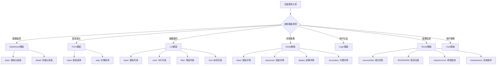

# CLAUDE.md

This file provides guidance to Claude Code (claude.ai/code) when working with code in this repository.

## 项目概述

**积木区DevOps (jimuqu-devops)** 是一个基于 **FastAPI + Celery + Docker + Vue3** 的现代化DevOps自动化部署平台，支持多语言项目的自动化编译、部署和监控。

**项目英文名**: jimuqu-devops
**项目中文名**: 积木区DevOps
**官方网站**: https://jimuqu.com

## 架构图


```mermaid
graph TB
    subgraph "前端层"
        A[Vue3 + TDesign前端] --> B[http://localhost:5173]
    end

    subgraph "API层"
        C[FastAPI后端] --> D[http://localhost:8000]
        C --> E[WebSocket实时日志]
    end

    subgraph "任务队列层"
        F[Redis消息队列] --> G[Celery Worker]
        F --> H[Celery Flower监控]
    end

    subgraph "执行层"
        G --> I[Docker编译引擎]
        G --> J[SSH部署服务]
    end

    A --> C
    C --> F
```

## 常用命令

### 开发环境启动

```bash
# 一键启动（推荐）
./dev-start.sh

# 手动启动后端
docker-compose up -d

# 手动启动前端
cd frontend
pnpm install
pnpm dev
```

### 前端开发命令

```bash
cd frontend

# 开发服务器
pnpm dev

# 构建生产版本
pnpm build

# 类型检查
pnpm build:type

# 代码检查
pnpm lint

# 代码修复
pnpm lint:fix

# 样式检查
pnpm stylelint

# 样式修复
pnpm stylelint:fix
```

### 后端开发命令

```bash
# 启动所有服务
docker-compose up -d

# 查看服务状态
docker-compose ps

# 查看日志
docker-compose logs -f web
docker-compose logs -f worker

# 启动监控面板（可选）
docker-compose --profile monitoring up -d flower
```

### 数据库操作

```bash
# 进入容器
docker-compose exec web bash

# 数据库迁移
alembic upgrade head

# 创建迁移文件
alembic revision --autogenerate -m "描述"
```

## 核心架构

### 后端架构 (FastAPI)

- **app/main.py**: 应用入口，配置CORS、路由、异常处理
- **app/api/**: API路由层
  - `projects.py`: 项目管理接口
  - `deployments.py`: 部署记录接口
  - `webhook.py`: Git Webhook接收
- **app/models/**: 数据模型层（SQLAlchemy ORM）
- **app/services/**: 业务逻辑层
  - `deployment_service.py`: 部署核心逻辑
  - `docker_service.py`: Docker操作封装
  - `ssh_service.py`: SSH部署封装
- **app/websocket.py**: WebSocket实时日志推送
- **worker/tasks.py**: Celery异步任务

### 前端架构 (Vue3 + TDesign)

基于 **lithe-admin** 框架：

- **技术栈**: Vue 3.5 + TypeScript + Vite 6 + TDesign + Pinia
- **目录结构**:
  - `src/pages/`: 页面组件
  - `src/components/`: 通用组件
  - `src/stores/`: Pinia状态管理
  - `src/utils/`: 工具函数
  - `src/api/`: API接口封装

### 前端模板系统

项目使用了完整的模板系统，所有新页面开发**必须**参考 `frontend/templates/` 目录中的模板。

#### 模板类型和用途


```mermaid
graph TD
    A[页面需求分析] --> B{选择模板类型}

    B -->|数据监控| C[Dashboard模板]
    B -->|信息录入| D[Form模板]
    B -->|数据展示| E[List模板]
    B -->|详情查看| F[Detail模板]
    B -->|用户认证| G[Login模板]
    B -->|结果反馈| H[Result模板]
    B -->|用户管理| I[User模板]

    C --> C1[base: 基础仪表板]
    C --> C2[detail: 详细仪表板]

    D --> D1[base: 基础表单]
    D --> D2[step: 步骤表单]

    E --> E1[base: 基础列表]
    E --> E2[card: 卡片列表]
    E --> E3[filter: 筛选列表]
    E --> E4[tree: 树形列表]

    F --> F1[base: 基础详情]
    F --> F2[advanced: 高级详情]
    F --> F3[deploy: 部署详情]
    F --> F4[secondary: 次要详情]

    H --> H1[success/fail: 成功失败]
    H --> H2[403/404/500: 错误页面]
    H --> H3[network-error: 网络错误]
    H --> H4[maintenance: 系统维护]
```

#### 模板使用流程

1. **需求分析**: 明确页面功能需求和交互逻辑
2. **模板选择**: 根据功能需求选择合适的模板类型
3. **代码复制**: 从 `frontend/templates/pages/` 复制对应模板到 `src/pages/`
4. **配置修改**: 修改页面配置、路由、API接口等
5. **样式调整**: 根据设计稿调整页面样式和布局
6. **功能扩展**: 添加业务逻辑和自定义功能
7. **测试验证**: 完成功能测试和兼容性测试

#### 核心模板详解

**Dashboard模板** (`frontend/templates/pages/dashboard/`)
- **用途**: 数据可视化、监控面板、统计分析页面
- **特点**: 图表展示、数据卡片、实时更新
- **组件**: TopPanel、MiddleChart、RankList、OutputOverview
- **技术**: ECharts + TDesign + 响应式布局

**Form模板** (`frontend/templates/pages/form/`)
- **用途**: 数据录入、信息配置、设置页面
- **特点**: 表单验证、文件上传、步骤式表单
- **组件**: 基础表单、步骤表单、多种输入控件
- **验证**: 完整的表单验证规则和错误处理

**List模板** (`frontend/templates/pages/list/`)
- **用途**: 数据展示、列表管理、搜索过滤
- **特点**: 表格展示、分页、排序、筛选、批量操作
- **组件**: 基础列表、卡片列表、筛选列表、树形列表
- **功能**: 搜索、高级筛选、虚拟滚动、数据缓存

#### 开发规范

**命名规范**:
- 组件名：`UserProfile.vue` (PascalCase)
- 文件名：`user-profile.vue` (kebab-case)
- 常量：`API_BASE_URL` (UPPER_SNAKE_CASE)
- 变量：`userName` (camelCase)

**代码结构**:
```vue
<script setup lang="ts">
// 1. 导入依赖
import { ref, onMounted } from 'vue';

// 2. 定义类型
interface Props {
  title: string;
}

// 3. 组件配置
defineOptions({
  name: 'ComponentName',
});

// 4. 响应式数据
const data = ref();

// 5. 生命周期
onMounted(() => {
  // 初始化逻辑
});
</script>
```

**样式规范**:
- 使用TDesign CSS变量：`var(--td-comp-padding-xl)`
- 响应式设计：桌面端、平板端、移动端适配
- 样式隔离：使用 `scoped` CSS

#### 最佳实践

**✅ 推荐做法**:
- 保持与模板相同的代码结构
- 使用TypeScript类型定义
- 遵循Vue 3 Composition API规范
- 添加适当的错误处理和加载状态
- 使用语义化HTML和无障碍访问

**❌ 避免做法**:
- 直接修改模板文件
- 硬编码业务数据
- 忽略类型安全
- 破坏组件结构
- 缺少错误处理

#### 文件组织结构

```
src/pages/feature-name/
├── index.vue              # 主页面文件
├── components/            # 页面专用组件
│   ├── ComponentA.vue
│   └── ComponentB.vue
├── constants.ts           # 常量定义
├── types.ts              # 类型定义
├── api.ts                # API接口
├── utils.ts              # 工具函数
└── index.less            # 样式文件
```

## 关键配置

### 环境变量

```bash
# 管理员账户
ADMIN_USERNAME=admin
ADMIN_PASSWORD=admin123

# 数据库
DATABASE_URL=sqlite:///./devops.db

# Redis
REDIS_URL=redis://redis:6379/0
CELERY_BROKER_URL=redis://redis:6379/1
CELERY_RESULT_BACKEND=redis://redis:6379/2

# 调试模式
DEBUG=true
LOG_LEVEL=INFO
```

### 重要端口

- **前端开发**: http://localhost:5173
- **后端API**: http://localhost:8000
- **API文档**: http://localhost:8000/docs
- **Flower监控**: http://localhost:5555
- **Redis**: 6379

## 部署流程

1. **项目配置**: 在管理界面配置项目信息、Git地址、部署参数
2. **Webhook配置**: 配置GitHub/GitLab Webhook触发自动部署
3. **任务执行**: Celery Worker执行Docker编译和SSH部署
4. **日志监控**: WebSocket实时推送部署日志

## 数据模型

### 核心实体

- **Project**: 项目信息（Git地址、语言、部署配置）
- **Deployment**: 部署记录（状态、日志、时间）
- **User**: 用户认证（简单单用户认证）

### 部署状态

- `pending`: 等待执行
- `running`: 正在部署
- `success`: 部署成功
- `failed`: 部署失败

## 开发规范

### 前端开发

- **页面开发**: 必须使用 `frontend/templates/` 中的模板
- **组件命名**: PascalCase
- **文件命名**: kebab-case
- **状态管理**: 使用Pinia，每个模块独立store
- **API调用**: 在store中封装，避免组件直接调用

### 后端开发

- **API设计**: 遵循RESTful规范
- **错误处理**: 使用统一的异常处理机制
- **日志记录**: 使用logging模块，包含详细的错误信息
- **数据库**: 使用SQLAlchemy ORM，通过Alembic管理迁移

### 安全注意事项

- 生产环境修改默认密码
- 使用SSH密钥而非密码
- 启用Webhook Secret验证
- 配置防火墙限制访问

## 故障排除

### 常见问题

1. **前端无法访问后端**: 检查 `docker-compose ps` 确认服务状态
2. **WebSocket连接失败**: 检查防火墙和端口配置
3. **Docker编译失败**: 确认Docker daemon正常运行
4. **SSH连接失败**: 验证目标主机SSH配置和凭据

### 日志查看

```bash
# 查看应用日志
docker-compose logs -f web

# 查看Worker日志
docker-compose logs -f worker

# 查看Redis日志
docker-compose logs -f redis
```

## 扩展开发

### 添加新的部署语言

1. 在 `app/services/docker_service.py` 中添加新的Dockerfile模板
2. 在前端 `src/constants/` 中添加语言选项
3. 更新项目配置表单

### 添加新的通知方式

1. 在 `worker/tasks.py` 中扩展通知逻辑
2. 在项目配置中添加通知设置
3. 实现对应的通知服务

## 性能优化

- **前端**: 路由懒加载、组件按需导入、图片CDN
- **后端**: 数据库索引、Redis缓存、Celery队列调优
- **部署**: Nginx反向代理、静态资源CDN、容器健康检查