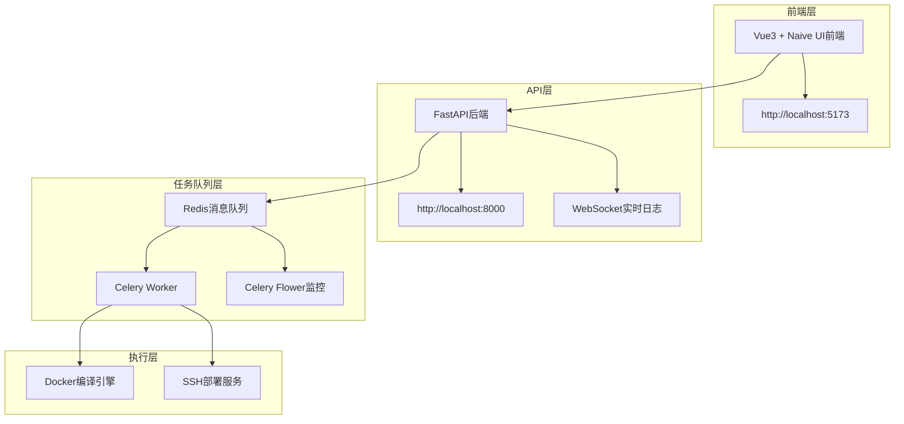

# CLAUDE.md

This file provides guidance to Claude Code (claude.ai/code) when working with code in this repository.

## 项目概述

**积木区DevOps (jimuqu-devops)** 是一个基于 **FastAPI + Celery + Docker + Vue3** 的现代化DevOps自动化部署平台，支持多语言项目的自动化编译、部署和监控。

**项目英文名**: jimuqu-devops
**项目中文名**: 积木区DevOps
**官方网站**: https://jimuqu.com

## 架构图


```mermaid
graph TB
    subgraph "前端层"
        A[Vue3 + Naive UI前端] --> B[http://localhost:5173]
    end

    subgraph "API层"
        C[FastAPI后端] --> D[http://localhost:8000]
        C --> E[WebSocket实时日志]
    end

    subgraph "任务队列层"
        F[Redis消息队列] --> G[Celery Worker]
        F --> H[Celery Flower监控]
    end

    subgraph "执行层"
        G --> I[Docker编译引擎]
        G --> J[SSH部署服务]
    end

    A --> C
    C --> F
```

## 常用命令

### 开发环境启动

```bash
# 一键启动（推荐）
./dev-start.sh

# 手动启动后端
docker-compose up -d

# 手动启动前端
cd ui
pnpm install
pnpm dev
```

### 前端开发命令

```bash
cd ui

# 开发服务器
pnpm dev

# 构建生产版本
pnpm build

# 类型检查
pnpm typecheck

# 代码检查
pnpm lint

# 生成路由
pnpm gen-route

# Git提交
pnpm commit

# 清理文件
pnpm cleanup

# 预览构建结果
pnpm preview
```

### 后端开发命令

```bash
# 启动所有服务
docker-compose up -d

# 查看服务状态
docker-compose ps

# 查看日志
docker-compose logs -f web
docker-compose logs -f worker

# 启动监控面板（可选）
docker-compose --profile monitoring up -d flower
```

### 数据库操作

```bash
# 进入容器
docker-compose exec web bash

# 数据库迁移
alembic upgrade head

# 创建迁移文件
alembic revision --autogenerate -m "描述"
```

## 核心架构

### 后端架构 (FastAPI)

- **app/main.py**: 应用入口，配置CORS、路由、异常处理
- **app/api/**: API路由层
  - `projects.py`: 项目管理接口
  - `deployments.py`: 部署记录接口
  - `webhook.py`: Git Webhook接收
- **app/models/**: 数据模型层（SQLAlchemy ORM）
- **app/services/**: 业务逻辑层
  - `deployment_service.py`: 部署核心逻辑
  - `docker_service.py`: Docker操作封装
  - `ssh_service.py`: SSH部署封装
- **app/websocket.py**: WebSocket实时日志推送
- **worker/tasks.py**: Celery异步任务

### 前端架构 (DevOps专用 - Vue3 + TypeScript)

基于 **Vue 3.5.22 + TypeScript 5.9.3 + Naive UI 2.43.1** 的专业化DevOps前端平台：

#### 技术栈精简版
- **核心框架**: Vue 3.5.22 + TypeScript 5.9.3 + Vite 7.1.12
- **UI组件库**: Naive UI 2.43.1 (腾讯开源，Vue3生态最佳组件库)
- **样式方案**: UnoCSS 66.5.4 (原子化CSS) + Sass 1.93.2
- **状态管理**: Pinia 3.0.3 (Vue3官方推荐)
- **路由系统**: Vue Router 4.6.3 + Elegant Router (自动化文件路由)
- **HTTP客户端**: Axios 1.12.2 + WebSocket (实时通信)
- **工具库**: VueUse 14.0.0 + Day.js 1.11.18
- **图表库**: ECharts 6.0.0 (仅保留必要的图表功能)
- **开发工具**: ESLint + Prettier + Vue TSC + Git Hooks

#### DevOps专业化架构
```
ui/
├── src/
│   ├── views/                    # DevOps业务页面
│   │   ├── dashboard/           # 仪表板 (系统总览)
│   │   ├── projects/            # 项目管理 (Git项目配置)
│   │   ├── deployments/         # 部署管理 (部署记录和状态)
│   │   ├── ci-cd/              # CI/CD流水线 (构建和部署流程)
│   │   ├── containers/         # 容器管理 (Docker容器)
│   │   ├── monitoring/         # 监控告警 (系统监控)
│   │   ├── logs/              # 日志系统 (日志查看和搜索)
│   │   ├── settings/          # 系统设置 (用户和配置)
│   │   └── _builtin/          # 内置页面 (登录、错误页)
│   ├── components/            # 组件系统
│   │   ├── devops/           # DevOps专用组件
│   │   │   ├── deployment-status.vue  # 部署状态组件
│   │   │   ├── pipeline-stage.vue     # 流水线阶段组件
│   │   │   ├── log-viewer.vue         # 实时日志查看器
│   │   │   ├── container-terminal.vue # 容器终端
│   │   │   └── metrics-chart.vue      # 监控指标图表
│   │   ├── business/         # 业务组件 (项目选择、环境切换等)
│   │   └── common/           # 通用组件 (布局、表单等)
│   ├── api/                  # API接口层
│   │   ├── projects.ts       # 项目管理API
│   │   ├── deployments.ts    # 部署管理API
│   │   ├── ci-cd.ts         # CI/CD API
│   │   ├── containers.ts     # 容器管理API
│   │   ├── monitoring.ts     # 监控API
│   │   ├── logs.ts          # 日志API
│   │   └── websocket.ts     # WebSocket连接
│   ├── hooks/               # DevOps专用Hooks
│   │   ├── useWebSocket.ts  # WebSocket实时连接
│   │   ├── useDeployment.ts # 部署状态管理
│   │   ├── useLogStream.ts  # 日志流处理
│   │   ├── usePolling.ts    # 状态轮询
│   │   └── useContainer.ts  # 容器操作
│   ├── store/               # 状态管理
│   │   ├── modules/
│   │   │   ├── auth.ts      # 用户认证和权限
│   │   │   ├── projects.ts  # 项目数据管理
│   │   │   ├── deployments.ts # 部署状态管理
│   │   │   ├── containers.ts # 容器状态管理
│   │   │   └── settings.ts  # 系统配置
│   ├── types/               # TypeScript类型定义
│   │   ├── api/            # API响应类型
│   │   ├── project.ts      # 项目相关类型
│   │   ├── deployment.ts   # 部署相关类型
│   │   ├── container.ts    # 容器相关类型
│   │   └── common.ts       # 通用类型
│   ├── utils/              # DevOps工具函数
│   │   ├── date.ts         # 时间处理
│   │   ├── format.ts       # 数据格式化
│   │   ├── validation.ts   # 表单验证
│   │   └── constants.ts    # 业务常量
│   └── constants/          # 业务常量
│       ├── status.ts       # 部署状态、容器状态等
│       └── config.ts       # 环境配置
```

#### 核心功能模块
1. **仪表板** - 系统总览、部署统计、状态监控
2. **项目管理** - Git项目配置、分支管理、环境设置
3. **部署管理** - 部署历史、实时状态、回滚操作
4. **CI/CD流水线** - 构建流程、部署流程、状态追踪
5. **容器管理** - Docker容器监控、日志查看、操作管理
6. **监控告警** - 系统指标、告警规则、通知设置
7. **日志系统** - 实时日志、日志搜索、日志下载
8. **系统设置** - 用户管理、权限配置、系统参数

#### 架构特点
- **业务导向**: 完全围绕DevOps业务流程设计
- **实时通信**: WebSocket支持实时日志和状态更新
- **模块化**: 每个功能模块独立，便于维护和扩展
- **类型安全**: 完整的TypeScript类型定义
- **组件化**: DevOps专用组件库，提高开发效率

### 前端路由系统

使用 **Elegant Router** 自动化文件路由系统，专为DevOps业务优化：

- **路由生成**: 基于文件结构自动生成路由配置
- **业务导向**: 完全按照DevOps业务流程设计路由
- **权限控制**: 基于角色的页面访问控制
- **实时更新**: 支持WebSocket状态实时更新
- **国际化**: 中英文双语支持

#### DevOps路由结构
```
src/views/
├── dashboard/           # 仪表板 (首页)
│   └── index.vue       # 系统总览，显示关键指标
├── projects/           # 项目管理
│   ├── index.vue       # 项目列表，支持搜索和筛选
│   ├── detail/[id].vue # 项目详情，配置信息和部署历史
│   └── create.vue      # 创建新项目
├── deployments/        # 部署管理
│   ├── index.vue       # 部署记录列表
│   ├── detail/[id].vue # 部署详情，实时日志和状态
│   └── create.vue      # 创建新部署
├── ci-cd/             # CI/CD流水线
│   ├── index.vue      # 流水线列表
│   ├── editor/[id].vue # 流水线编辑器
│   └── history/[id].vue # 构建历史
├── containers/        # 容器管理
│   ├── index.vue      # 容器列表
│   ├── detail/[id].vue # 容器详情和终端
│   └── logs/[id].vue  # 容器日志
├── monitoring/        # 监控告警
│   ├── index.vue      # 监控总览
│   ├── alerts.vue     # 告警列表
│   └── metrics.vue    # 指标图表
├── logs/             # 日志系统
│   ├── index.vue     # 日志查看器
│   ├── search.vue    # 日志搜索
│   └── download.vue  # 日志下载
├── settings/         # 系统设置
│   ├── index.vue     # 基础设置
│   ├── users.vue     # 用户管理
│   └── config.vue    # 系统配置
└── _builtin/         # 内置页面
    ├── login/index.vue # 登录页面
    ├── 404/index.vue  # 页面不存在
    └── 500/index.vue  # 服务器错误
```

#### 路由配置示例
```typescript
// dashboard路由
{
  name: 'dashboard',
  path: '/',
  component: 'layout.base$view.dashboard',
  meta: {
    title: 'dashboard',
    i18nKey: 'route.dashboard',
    icon: 'mdi:monitor-dashboard',
    order: 1,
    roles: ['*'] // 所有人可访问
  }
}

// 部署管理路由
{
  name: 'deployments',
  path: '/deployments',
  component: 'layout.base$view.deployments',
  meta: {
    title: 'deployments',
    i18nKey: 'route.deployments',
    icon: 'mdi:rocket-launch',
    order: 2,
    roles: ['R_ADMIN', 'R_DEPLOYER'] // 管理员和部署者可访问
  }
}

// 容器管理路由
{
  name: 'containers',
  path: '/containers',
  component: 'layout.base$view.containers',
  meta: {
    title: 'containers',
    i18nKey: 'route.containers',
    icon: 'mdi:docker',
    order: 3,
    roles: ['R_ADMIN', 'R_DEVOPS'] // 管理员和DevOps可访问
  }
}
```

### 前端状态管理

使用 **Pinia** 进行DevOps业务状态管理，完全模块化设计：

- **业务导向**: 每个store对应一个DevOps业务模块
- **实时状态**: WebSocket实时更新状态
- **类型安全**: 完整的TypeScript类型定义
- **持久化**: 关键配置本地持久化存储

#### DevOps核心Store模块
```typescript
// auth store - 用户认证和权限管理
export const useAuthStore = defineStore(SetupStoreId.Auth, () => {
  const token = ref(getToken());
  const userInfo = reactive<Api.Auth.UserInfo>({
    userId: '',
    userName: '',
    roles: [],
    permissions: []
  });

  const isLogin = computed(() => Boolean(token.value));
  const hasRole = (role: string) => userInfo.roles.includes(role);
  const hasPermission = (permission: string) => userInfo.permissions.includes(permission);

  const login = async (loginForm: Api.Auth.LoginFormItem) => {
    const { data } = await authApi.login(loginForm);
    token.value = data.token;
    Object.assign(userInfo, data.userInfo);
    localStg.set('token', data.token);
    localStg.set('userInfo', data.userInfo);
  };

  const logout = async () => {
    await authApi.logout();
    token.value = '';
    Object.assign(userInfo, { userId: '', userName: '', roles: [], permissions: [] });
    localStg.remove('token');
    localStg.remove('userInfo');
  };

  return { token, userInfo, isLogin, hasRole, hasPermission, login, logout };
});

// projects store - 项目数据管理
export const useProjectsStore = defineStore(SetupStoreId.Projects, () => {
  const projects = ref<Api.Project.Project[]>([]);
  const currentProject = ref<Api.Project.Project | null>(null);
  const loading = ref(false);

  const fetchProjects = async () => {
    loading.value = true;
    try {
      const { data } = await projectApi.getProjects();
      projects.value = data;
    } finally {
      loading.value = false;
    }
  };

  const createProject = async (project: Api.Project.ProjectCreate) => {
    const { data } = await projectApi.createProject(project);
    projects.value.push(data);
    return data;
  };

  const setCurrentProject = (project: Api.Project.Project) => {
    currentProject.value = project;
    localStg.set('currentProjectId', project.id);
  };

  return { projects, currentProject, loading, fetchProjects, createProject, setCurrentProject };
});

// deployments store - 部署状态管理 (支持实时更新)
export const useDeploymentsStore = defineStore(SetupStoreId.Deployments, () => {
  const deployments = ref<Api.Deployment.Deployment[]>([]);
  const activeDeployment = ref<Api.Deployment.Deployment | null>(null);
  const deploymentLogs = ref<string[]>([]);

  // WebSocket连接用于实时日志
  const logWebSocket = ref<WebSocket | null>(null);

  const fetchDeployments = async () => {
    const { data } = await deploymentApi.getDeployments();
    deployments.value = data;
  };

  const createDeployment = async (deployment: Api.Deployment.DeploymentCreate) => {
    const { data } = await deploymentApi.createDeployment(deployment);
    deployments.value.unshift(data);
    return data;
  };

  const subscribeToLogs = (deploymentId: string) => {
    if (logWebSocket.value) {
      logWebSocket.value.close();
    }

    logWebSocket.value = new WebSocket(`ws://localhost:8000/ws/deployments/${deploymentId}/logs`);
    logWebSocket.value.onmessage = (event) => {
      const logEntry = JSON.parse(event.data);
      deploymentLogs.value.push(logEntry.message);
    };
  };

  const unsubscribeFromLogs = () => {
    if (logWebSocket.value) {
      logWebSocket.value.close();
      logWebSocket.value = null;
    }
    deploymentLogs.value = [];
  };

  return {
    deployments,
    activeDeployment,
    deploymentLogs,
    fetchDeployments,
    createDeployment,
    subscribeToLogs,
    unsubscribeFromLogs
  };
});

// containers store - 容器状态管理
export const useContainersStore = defineStore(SetupStoreId.Containers, () => {
  const containers = ref<Api.Container.Container[]>([]);
  const selectedContainer = ref<Api.Container.Container | null>(null);

  const fetchContainers = async () => {
    const { data } = await containerApi.getContainers();
    containers.value = data;
  };

  const restartContainer = async (containerId: string) => {
    await containerApi.restartContainer(containerId);
    await fetchContainers(); // 刷新状态
  };

  const stopContainer = async (containerId: string) => {
    await containerApi.stopContainer(containerId);
    await fetchContainers(); // 刷新状态
  };

  return { containers, selectedContainer, fetchContainers, restartContainer, stopContainer };
});
```

### API请求封装 (DevOps专用)

专业的DevOps API请求封装，支持实时通信：

```typescript
// api/request/index.ts - DevOps API客户端
export const devopsRequest = createFlatRequest<Api.Global.CommonResponseType>({
  baseURL: import.meta.env.VITE_DEVOPS_API_URL || 'http://localhost:8000',
  headers: {
    'Content-Type': 'application/json'
  },
  onRequest: ({ config }) => {
    // 自动添加认证token
    const token = localStg.get('token');
    if (token) {
      config.headers.Authorization = `Bearer ${token}`;
    }
  },
  onResponse: ({ response }) => {
    // 统一错误处理
    if (response.data?.code === 401) {
      useAuthStore().logout();
      window.location.href = '/login';
    }
    return response.data;
  },
  onError: (error) => {
    // 统一错误提示
    window.$message?.error(error.message || '请求失败');
  }
});

// api/websocket.ts - WebSocket连接管理
export class DevOpsWebSocket {
  private ws: WebSocket | null = null;
  private url: string;
  private reconnectAttempts = 0;
  private maxReconnectAttempts = 5;

  constructor(url: string) {
    this.url = url;
  }

  connect() {
    try {
      this.ws = new WebSocket(this.url);
      this.ws.onopen = () => {
        console.log('WebSocket连接成功');
        this.reconnectAttempts = 0;
      };
      this.ws.onclose = () => {
        console.log('WebSocket连接关闭');
        this.reconnect();
      };
      this.ws.onerror = (error) => {
        console.error('WebSocket错误:', error);
      };
    } catch (error) {
      console.error('WebSocket连接失败:', error);
      this.reconnect();
    }
  }

  private reconnect() {
    if (this.reconnectAttempts < this.maxReconnectAttempts) {
      setTimeout(() => {
        this.reconnectAttempts++;
        this.connect();
      }, 1000 * this.reconnectAttempts);
    }
  }

  send(data: any) {
    if (this.ws?.readyState === WebSocket.OPEN) {
      this.ws.send(JSON.stringify(data));
    }
  }

  close() {
    this.ws?.close();
  }
}

// api/projects.ts - 项目管理API
export const projectApi = {
  getProjects: () => devopsRequest.get<Api.Project.Project[]>('/projects'),
  getProject: (id: string) => devopsRequest.get<Api.Project.Project>(`/projects/${id}`),
  createProject: (project: Api.Project.ProjectCreate) =>
    devopsRequest.post<Api.Project.Project>('/projects', project),
  updateProject: (id: string, project: Api.Project.ProjectUpdate) =>
    devopsRequest.put<Api.Project.Project>(`/projects/${id}`, project),
  deleteProject: (id: string) => devopsRequest.delete(`/projects/${id}`)
};

// api/deployments.ts - 部署管理API
export const deploymentApi = {
  getDeployments: () => devopsRequest.get<Api.Deployment.Deployment[]>('/deployments'),
  getDeployment: (id: string) => devopsRequest.get<Api.Deployment.Deployment>(`/deployments/${id}`),
  createDeployment: (deployment: Api.Deployment.DeploymentCreate) =>
    devopsRequest.post<Api.Deployment.Deployment>('/deployments', deployment),
  stopDeployment: (id: string) => devopsRequest.post(`/deployments/${id}/stop`),
  rollbackDeployment: (id: string) => devopsRequest.post(`/deployments/${id}/rollback`),
  getDeploymentLogs: (id: string) => devopsRequest.get<string[]>(`/deployments/${id}/logs`)
};

// api/containers.ts - 容器管理API
export const containerApi = {
  getContainers: () => devopsRequest.get<Api.Container.Container[]>('/containers'),
  getContainer: (id: string) => devopsRequest.get<Api.Container.Container>(`/containers/${id}`),
  restartContainer: (id: string) => devopsRequest.post(`/containers/${id}/restart`),
  stopContainer: (id: string) => devopsRequest.post(`/containers/${id}/stop`),
  getContainerLogs: (id: string) => devopsRequest.get<string>(`/containers/${id}/logs`)
};
```

### 前端样式系统

使用 **UnoCSS** 原子化CSS框架 + Naive UI + 自定义主题系统：

- **原子化CSS**: UnoCSS 66.5.4，高性能按需生成
- **主题系统**: 支持深色/浅色模式，动态主题色切换
- **响应式设计**: 内置断点系统，移动端完美适配
- **组件库**: Naive UI 2.43.1，完整的设计系统
- **样式预处理**: Sass 1.93.2，支持现代CSS编译器

#### UnoCSS 配置
```typescript
// uno.config.ts
export default defineConfig<Theme>({
  theme: {
    ...themeVars,
    fontSize: {
      'icon-xs': '0.875rem',
      'icon-small': '1rem',
      icon: '1.125rem',
      'icon-large': '1.5rem',
      'icon-xl': '2rem'
    }
  },
  shortcuts: {
    'card-wrapper': 'rd-8px shadow-sm'
  },
  transformers: [transformerDirectives(), transformerVariantGroup()],
  presets: [
    presetWind3({ dark: 'class' }),
    presetSoybeanAdmin() // 自定义预设
  ]
});
```

#### 主题配置
```typescript
// theme/settings.ts
export const themeSettings: App.Theme.ThemeSetting = {
  themeScheme: 'light',        // 'light' | 'dark' | 'auto'
  themeColor: '#646cff',       // 动态主题色
  themeRadius: 6,              // 圆角大小
  layout: {
    mode: 'vertical',          // 'vertical' | 'horizontal' | 'vertical-mix' | 'horizontal-mix'
    scrollMode: 'content'      // 滚动模式
  },
  header: {
    height: 56,                // 头部高度
    breadcrumb: {
      visible: true,
      showIcon: true
    }
  },
  tab: {
    visible: true,             // 显示标签页
    cache: true,               // 缓存页面
    height: 44,                // 标签页高度
    mode: 'chrome'             // 'chrome' | 'button' | 'slider'
  }
};
```

#### 样式文件结构
```
src/styles/
├── css/
│   ├── global.css         # 全局样式
│   ├── reset.css          # 样式重置
│   ├── transition.css     # 过渡动画
│   └── nprogress.css      # 进度条样式
├── scss/
│   ├── global.scss        # 全局SCSS变量
│   └── scrollbar.scss     # 滚动条样式
└── theme/
    └── vars.ts            # 主题变量定义
```

### 前端组件系统

完整的组件生态系统：内部组件包 + UI组件库 + 业务组件

#### 内置组件包 (packages/*)
```typescript
// @sa/materials - 布局组件库
export { default as AdminLayout } from './admin-layout';
export { default as PageTab } from './page-tab';
export { default as SimpleScrollbar } from './simple-scrollbar';

// @sa/hooks - 自定义Hooks
export { useRequest } from './use-request';     // 数据请求Hook
export { useTable } from './use-table';         // 表格操作Hook
export { useBoolean } from './use-boolean';     // 布尔值管理
export { useLoading } from './use-loading';     // 加载状态
export { useCountDown } from './use-count-down'; // 倒计时
export { useContext } from './use-context';     // 上下文管理

// @sa/axios - HTTP请求封装
export { request, demoRequest } from './index';
export { createFlatRequest } from './shared';

// @sa/utils - 工具函数库
export { encrypt } from './crypto';     // 加密工具
export { localStg, sessionStg } from './storage'; // 存储工具
export { cloneDeep } from './klona';    // 深拷贝
export { nanoid } from './nanoid';      // ID生成
```

#### UI组件库
- **Naive UI**: 主要组件库，提供完整的Vue3组件生态
- **Pro Naive UI**: 高级组件封装，增强功能
- **自定义组件**: 基于业务需求的高级组件封装

#### 组件开发规范
```vue
<script setup lang="ts">
// 1. 导入依赖
import { ref, computed, onMounted } from 'vue';

// 2. 组件配置
defineOptions({
  name: 'ComponentName', // PascalCase命名
});

// 3. 类型定义
interface Props {
  title: string;
  disabled?: boolean;
}

interface Emits {
  change: [value: string];
  click: [event: MouseEvent];
}

// 4. Props和Emits
const props = withDefaults(defineProps<Props>(), {
  disabled: false,
});

const emit = defineEmits<Emits>();

// 5. 响应式数据
const count = ref(0);
const isVisible = ref(false);

// 6. 计算属性
const doubledCount = computed(() => count.value * 2);

// 7. 方法
const handleClick = () => {
  count.value++;
  emit('change', count.value.toString());
};

// 8. 生命周期
onMounted(() => {
  // 初始化逻辑
});
</script>

<template>
  <div class="component-wrapper">
    <!-- 模板内容 -->
  </div>
</template>

<style scoped>
/* 组件样式 */
</style>
```

## API请求封装

双重HTTP客户端设计，支持不同业务场景：

### HTTP客户端架构
```typescript
// service/request/index.ts - 主要API客户端
export const request = createFlatRequest<Api.Global.CommonResponseType>({
  baseURL: import.meta.env.VITE_SERVICE_BASE_URL,
  headers: {
    apifoxToken: 'XL299LiMEDZ0H5h3A29PxwQXdMJqWyY2'
  },
  onRequest: ({ config }) => {
    // 自动添加认证token
    const token = localStg.get('token');
    if (token) {
      config.headers.Authorization = token;
    }
  },
  onResponse: ({ response }) => {
    // 统一响应处理
    if (response.data?.code === 401) {
      // token过期处理
      useAuthStore().logout();
    }
    return response.data;
  }
});

// service-alova/request/index.ts - 演示API客户端
export const demoRequest = createRequest({
  baseURL: otherBaseURL.demo,
  timeout: 10000,
  async onRequest({ config }) {
    // 演示环境特殊处理
  },
  async onResponse({ response }) {
    // 演示数据转换
  }
});
```

### API服务层
```typescript
// service/api/auth.ts - 认证API
export function fetchLogin(loginForm: Api.Auth.LoginFormItem) {
  return request.post<Api.Auth.LoginResult>('/auth/login', loginForm);
}

export function fetchUserInfo() {
  return request.get<Api.Auth.UserInfo>('/auth/user-info');
}

// service/api/projects.ts - 项目管理API
export function fetchProjects() {
  return request.get<Api.Project.Project[]>('/projects');
}

export function createProject(project: Api.Project.ProjectCreate) {
  return request.post<Api.Project.Project>('/projects', project);
}
```

### 请求特性
- **自动Token管理**: 请求头自动添加认证信息
- **Token刷新**: 自动处理过期token
- **错误处理**: 统一的错误处理和提示
- **重试机制**: 网络错误自动重试
- **请求缓存**: 支持GET请求缓存
- **Loading状态**: 自动管理全局loading状态

## 国际化系统

完整的国际化支持：

### i18n配置
```typescript
// locales/index.ts
import { createI18n } from 'vue-i18n';
import { localStg } from '@sa/utils';
import { messages } from './locales';

const i18n = createI18n({
  legacy: false,
  locale: localStg.get('lang') || 'zh-CN',
  fallbackLocale: 'en-US',
  messages,
  globalInjection: true
});

export default i18n;
```

### 语言支持
```typescript
// locales/langs/zh-cn.ts
export default {
  system: {
    title: '积木区DevOps',
    logo: '积木区'
  },
  route: {
    home: '首页',
    projects: '项目管理',
    deployments: '部署记录'
  },
  common: {
    confirm: '确认',
    cancel: '取消',
    save: '保存'
  }
};

// locales/langs/en-us.ts
export default {
  system: {
    title: 'Jimuqu DevOps',
    logo: 'Jimuqu'
  },
  route: {
    home: 'Home',
    projects: 'Projects',
    deployments: 'Deployments'
  },
  common: {
    confirm: 'Confirm',
    cancel: 'Cancel',
    save: 'Save'
  }
};
```

### 路由国际化
每个路由都有对应的i18nKey，支持多语言菜单：
```typescript
// router/elegant/routes.ts
{
  name: 'home',
  meta: {
    title: 'home',
    i18nKey: 'route.home' // 对应 locales/langs/xx.ts 中的键名
  }
}
```

## 开发工具链

### 代码质量保证
```javascript
// eslint.config.js
import antfu from '@antfu/eslint-config';

export default defineConfig(
  { vue: true, unocss: true },
  {
    rules: {
      'vue/multi-word-component-names': ['warn', {
        ignores: ['index', 'App', 'Register', '[id]', '[url]']
      }],
      'vue/component-name-in-template-casing': ['warn', 'PascalCase'],
      'node/prefer-global/process': 'off'
    }
  }
);
```

### Git Hooks
```json
// package.json
{
  "simple-git-hooks": {
    "commit-msg": "pnpm sa git-commit-verify",
    "pre-commit": "pnpm typecheck && pnpm lint && git diff --exit-code"
  }
}
```

### 构建配置
```typescript
// vite.config.ts
export default defineConfig(configEnv => {
  const viteEnv = loadEnv(configEnv.mode, process.cwd());

  return {
    base: viteEnv.VITE_BASE_URL,
    resolve: {
      alias: {
        '~': fileURLToPath(new URL('./', import.meta.url)),
        '@': fileURLToPath(new URL('./src', import.meta.url))
      }
    },
    css: {
      preprocessorOptions: {
        scss: {
          api: 'modern-compiler',
          additionalData: `@use "@/styles/scss/global.scss" as *;`
        }
      }
    },
    server: {
      host: '0.0.0.0',
      port: 9527,
      open: true,
      proxy: createViteProxy(viteEnv, enableProxy)
    }
  };
});
```

### 环境变量

```bash
# DevOps前端环境变量
VITE_DEVOPS_API_URL=http://localhost:8000     # 后端API地址
VITE_WS_URL=ws://localhost:8000/ws           # WebSocket地址
VITE_BASE_URL=/                              # 应用基础路径
VITE_PORT=9527                               # 开发服务器端口

# 认证配置
VITE_TOKEN_KEY=devops_token                  # Token存储键名
VITE_USER_INFO_KEY=devops_user_info          # 用户信息存储键名

# 功能开关
VITE_ENABLE_MONITORING=true                  # 启用监控功能
VITE_ENABLE_LOG_STREAM=true                  # 启用日志流
VITE_ENABLE_CONTAINER_TERMINAL=true          # 启用容器终端

# 管理员账户
ADMIN_USERNAME=admin
ADMIN_PASSWORD=admin123

# 数据库
DATABASE_URL=sqlite:///./devops.db

# Redis
REDIS_URL=redis://redis:6379/0
CELERY_BROKER_URL=redis://redis:6379/1
CELERY_RESULT_BACKEND=redis://redis:6379/2

# 调试模式
DEBUG=true
LOG_LEVEL=INFO
```

## DevOps开发规范

### 前端开发规范

#### 页面开发规范
- **页面结构**: 基于 `src/views/` 目录的文件路由系统
- **命名规范**:
  - 页面目录: kebab-case (如: project-management)
  - 组件名: PascalCase (如: ProjectList)
  - 文件名: kebab-case (如: project-list.vue)
- **路由配置**: 使用 `pnpm gen-route` 自动生成路由配置
- **权限控制**: 在路由meta中配置roles字段

#### 组件开发规范
```vue
<script setup lang="ts">
// 1. 导入依赖 (优先导入外部库，然后内部组件)
import { ref, computed, onMounted, onUnmounted } from 'vue';
import { useRouter } from 'vue-router';

// 2. 组件配置
defineOptions({
  name: 'DeploymentStatus', // PascalCase命名
  inheritAttrs: false
});

// 3. 类型定义 (接口以Api开头，Props以Props结尾)
interface Props {
  deployment: Api.Deployment.Deployment;
  showLogs?: boolean;
  refreshInterval?: number;
}

interface Emits {
  'status-change': [status: Api.Deployment.Status];
  'log-received': [log: string];
}

// 4. Props和Emits
const props = withDefaults(defineProps<Props>(), {
  showLogs: false,
  refreshInterval: 5000
});

const emit = defineEmits<Emits>();

// 5. 响应式数据 (使用ref、reactive、computed)
const status = ref<Api.Deployment.Status>(props.deployment.status);
const logs = ref<string[]>([]);
const loading = ref(false);

const isRunning = computed(() => status.value === 'running');
const hasFailed = computed(() => status.value === 'failed');

// 6. Hooks使用 (优先使用自定义Hooks)
const { subscribeToLogs, unsubscribeFromLogs } = useDeploymentLogs();
const router = useRouter();

// 7. 方法
const handleStatusChange = (newStatus: Api.Deployment.Status) => {
  status.value = newStatus;
  emit('status-change', newStatus);
};

const handleLogReceived = (log: string) => {
  logs.value.push(log);
  emit('log-received', log);
};

// 8. 生命周期
onMounted(() => {
  if (props.showLogs) {
    subscribeToLogs(props.deployment.id, handleLogReceived);
  }
});

onUnmounted(() => {
  unsubscribeFromLogs();
});
</script>

<template>
  <div class="deployment-status">
    <!-- DevOps专用组件内容 -->
  </div>
</template>

<style scoped>
/* 使用UnoCSS类名，避免手写CSS */
.deployment-status {
  @apply p-4 border border-gray-200 rounded-lg;
}
</style>
```

#### API开发规范
- **API文件**: 按业务模块分类 (projects.ts, deployments.ts, containers.ts)
- **类型定义**: 使用完整的TypeScript类型定义
- **错误处理**: 统一的错误处理和用户提示
- **实时通信**: WebSocket用于实时日志和状态更新

#### 状态管理规范
- **Store命名**: 按业务模块命名 (useProjectsStore, useDeploymentsStore)
- **状态结构**: 使用ref和reactive，避免复杂的嵌套对象
- **异步操作**: 在store中处理API调用和错误处理
- **持久化**: 关键配置信息使用localStorage持久化

### 代码质量规范

#### TypeScript规范
- **严格模式**: 启用所有严格的TypeScript检查
- **类型定义**: 为所有函数、变量、组件提供明确的类型定义
- **接口命名**: 接口以I开头，类型定义以T开头，API类型以Api开头

#### 代码检查
```javascript
// eslint.config.js
export default defineConfig(
  { vue: true, unocss: true },
  {
    rules: {
      'vue/component-name-in-template-casing': ['warn', 'PascalCase'],
      'vue/multi-word-component-names': 'off', // DevOps组件可以是单个词
      'no-console': 'warn', // 开发时允许console，生产环境警告
      'prefer-const': 'error',
      'no-var': 'error'
    }
  }
);
```

#### Git提交规范
- **提交格式**: `type(scope): description`
- **类型**: feat(新功能), fix(修复), docs(文档), style(样式), refactor(重构), test(测试), chore(构建)
- **DevOps示例**:
  - `feat(deployment): 添加实时日志功能`
  - `fix(container): 修复容器状态更新问题`
  - `refactor(api): 重构项目API接口`

### 业务规范

#### DevOps功能优先级
1. **核心功能**: 项目管理、部署管理、实时日志
2. **重要功能**: CI/CD流水线、容器管理
3. **扩展功能**: 监控告警、日志搜索、系统设置

#### WebSocket使用规范
- **连接管理**: 自动重连机制，避免连接泄漏
- **数据格式**: 使用JSON格式，包含时间戳和类型信息
- **错误处理**: 连接失败时提供用户友好的错误提示

#### 安全规范
- **认证**: 所有API请求必须携带有效的JWT token
- **权限**: 基于角色的访问控制，前端和后端双重验证
- **敏感信息**: 不在前端存储密码、私钥等敏感信息

## 前端页面模板系统

### 模板目录结构

项目包含完整的前端页面模板系统，专为AI大模型代码生成而设计：

```
templates/
├── README.md                    # 模板系统总说明文档
├── auth/                        # 认证相关页面模板
│   └── README.md               # 认证模板使用说明
├── manage/                      # 管理后台页面模板
│   ├── user/                   # 用户管理模板
│   ├── role/                   # 角色管理模板
│   └── menu/                   # 菜单管理模板
├── form/                        # 表单组件模板
│   ├── basic/                  # 基础表单模板
│   ├── query/                  # 查询表单模板
│   └── step/                   # 步骤表单模板
├── table/                       # 数据表格模板
│   ├── remote/                 # 远程数据表格
│   └── row-edit/               # 行内编辑表格
├── chart/                       # 图表组件模板
│   ├── echarts/                # ECharts图表
│   ├── antv/                   # AntV图表
│   └── vchart/                 # VChart商业图表
├── function/                    # 功能页面模板
├── plugin/                      # 插件功能模板
└── builtin/                     # 内置页面模板
    ├── login/                  # 登录页面
    ├── 404/                    # 404页面
    └── 500/                    # 500页面
```

### 🚫 模板管理规则

#### 禁止行为
1. **禁止直接修改** - 未经明确允许，任何人不得修改 `templates/` 目录下的任何文件
2. **禁止删除** - 禁止删除任何模板文件
3. **禁止重命名** - 禁止重命名模板文件或目录结构
4. **禁止复制粘贴** - 禁止将模板内容直接复制到业务代码中使用

#### 使用规范
1. **参考使用** - AI模型应基于这些模板生成新的业务代码，而不是直接使用
2. **理解原理** - 开发者应理解模板的设计原理和架构模式
3. **适配业务** - 根据具体业务需求调整模板结构和实现
4. **保持更新** - 定期同步最新的最佳实践到模板

### 🎯 模板使用指南

#### AI大模型使用方式
```prompt
请参考 templates/manage/user/index.vue 模板，为我创建一个新的项目管理页面，要求：
1. 保持相同的代码结构和风格
2. 适配项目管理的业务逻辑
3. 使用相同的组件库和API调用方式
4. 修改用户相关字段为项目相关字段
```

#### 开发者使用方式
1. **理解模板** - 先理解模板的设计思路和技术实现
2. **分析需求** - 分析模板与业务需求的匹配度
3. **AI生成** - 让AI基于模板生成适配的代码
4. **微调优化** - 根据实际情况进行必要的调整

#### 模板分类说明

**认证模板 (auth/)**
- 登录页面：支持多种登录方式
- 权限页面：403、404、500错误页面
- 特点：完整的认证流程、表单验证、响应式设计

**管理模板 (manage/)**
- 用户管理：完整的CRUD操作、权限控制
- 角色管理：权限分配、菜单权限、按钮权限
- 特点：数据密集、操作便捷、批量处理

**表单模板 (form/)**
- 基础表单：多种输入类型、验证规则
- 查询表单：条件搜索、高级搜索、快捷操作
- 步骤表单：向导模式、进度指示、数据暂存
- 特点：验证完整、交互友好、响应式布局

**表格模板 (table/)**
- 远程表格：异步加载、分页排序、筛选搜索
- 行内编辑：直接编辑、批量编辑、验证保存
- 特点：功能强大、性能优化、操作便捷

**图表模板 (chart/)**
- ECharts：传统图表、组合图表、实时更新
- AntV：现代图表、可视化效果
- VChart：商业报表、专业图表
- 特点：数据可视化、交互丰富、响应式适配

### 🔄 模板维护机制

#### 模板更新
- **定期同步** - 定期从主项目同步最新的代码改进
- **最佳实践** - 保持模板的时效性和最佳实践
- **问题修复** - 修复发现的问题和性能优化
- **版本记录** - 每次更新都需要记录变更说明

#### 扩展规则
- **新模板创建** - 如需新的模板类型，由项目维护者创建
- **模板优化** - 模板优化建议需要经过评审后实施
- **文档更新** - 模板变更必须同步更新文档

### 📞 联系方式

如有模板使用问题或改进建议，请联系项目维护者。

---
**创建时间**: 2025-01-30
**最后更新**: 2025-01-30
**维护者**: AI Assistant
**版本**: 1.0.0

## 重要端口

- **前端开发**: http://localhost:9527 (Vite开发服务器)
- **后端API**: http://localhost:8000 (FastAPI服务)
- **WebSocket**: ws://localhost:8000/ws (实时通信)
- **API文档**: http://localhost:8000/docs (Swagger UI)
- **Flower监控**: http://localhost:5555 (Celery监控面板)
- **Redis**: 6379
- **构建预览**: http://localhost:4173 (Vite Preview)

## 部署流程

1. **项目配置**: 在管理界面配置项目信息、Git地址、部署参数
2. **Webhook配置**: 配置GitHub/GitLab Webhook触发自动部署
3. **任务执行**: Celery Worker执行Docker编译和SSH部署
4. **日志监控**: WebSocket实时推送部署日志

## 数据模型

### 核心实体

- **Project**: 项目信息（Git地址、语言、部署配置）
- **Deployment**: 部署记录（状态、日志、时间）
- **User**: 用户认证（简单单用户认证）

### 部署状态

- `pending`: 等待执行
- `running`: 正在部署
- `success`: 部署成功
- `failed`: 部署失败

## 开发规范

### 前端开发

- **页面开发**: 基于文件路由系统，在 `src/views/` 目录下创建页面
- **组件命名**: PascalCase
- **文件命名**: kebab-case
- **状态管理**: 使用Pinia，每个模块独立store
- **API调用**: 在 `src/service/` 中封装API请求
- **样式开发**: 使用UnoCSS原子化类和Naive UI组件
- **类型安全**: 严格的TypeScript类型检查
- **代码规范**: 集成ESLint和Prettier，遵循SoybeanJS规范
- **菜单设计**: 前端左侧菜单只制作一级菜单，不使用二级菜单的方式。所有功能模块都应该在一级菜单中直接访问，避免复杂的嵌套菜单结构

### 后端开发

- **API设计**: 遵循RESTful规范
- **错误处理**: 使用统一的异常处理机制
- **日志记录**: 使用logging模块，包含详细的错误信息
- **数据库**: 使用SQLAlchemy ORM，通过Alembic管理迁移

### 安全注意事项

- 生产环境修改默认密码
- 使用SSH密钥而非密码
- 启用Webhook Secret验证
- 配置防火墙限制访问

## 故障排除

### 常见问题

1. **前端无法访问后端**: 检查 `docker-compose ps` 确认服务状态
2. **WebSocket连接失败**: 检查防火墙和端口配置
3. **Docker编译失败**: 确认Docker daemon正常运行
4. **SSH连接失败**: 验证目标主机SSH配置和凭据

### 日志查看

```bash
# 查看应用日志
docker-compose logs -f web

# 查看Worker日志
docker-compose logs -f worker

# 查看Redis日志
docker-compose logs -f redis
```

## 扩展开发

### 添加新的部署语言

1. 在 `app/services/docker_service.py` 中添加新的Dockerfile模板
2. 在前端 `src/constants/` 中添加语言选项
3. 更新项目配置表单

### 添加新页面

1. 在 `src/views/` 目录下创建新的页面文件夹和index.vue
2. 使用 `pnpm gen-route` 自动生成路由配置
3. 在路由meta中配置页面标题、图标等信息
4. 如需权限控制，在meta中添加权限配置

### 添加新组件

1. 通用组件放在 `src/components/` 目录
2. 页面专用组件放在对应页面的 `components/` 子目录
3. 使用TypeScript定义组件Props和Emits类型
4. 遵循Vue 3 Composition API规范

## 性能优化

- **前端**: 路由懒加载、组件按需导入、图片CDN
- **后端**: 数据库索引、Redis缓存、Celery队列调优
- **部署**: Nginx反向代理、静态资源CDN、容器健康检查