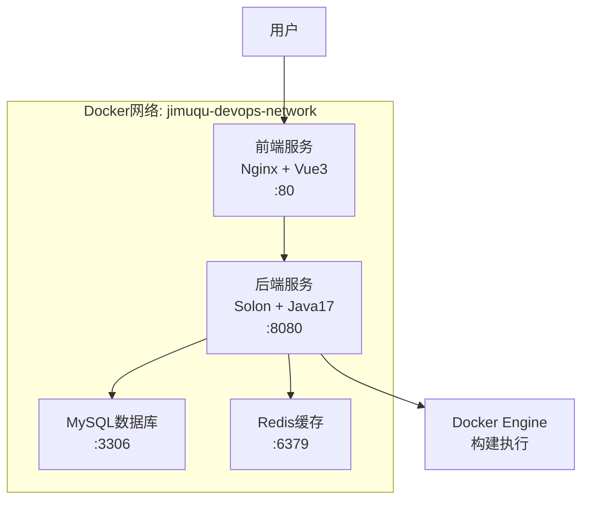

# Jimuqu DevOps 平台 - Docker 部署指南

## 🐳 Docker 环境完整部署

我已经为Jimuqu DevOps平台创建了完整的Docker化部署方案，包含前端、后端、数据库等所有服务。

### 📋 部署组件

```
jimuqu-devops/
├── docker-compose.yml          # 主要的Docker Compose配置
├── docker-compose.local.yml    # 本地测试配置
├── start-docker.bat           # Windows一键启动脚本
├── start-docker.sh            # Linux/Mac一键启动脚本
├── backend/
│   ├── Dockerfile             # 后端生产环境镜像
│   └── Dockerfile.local       # 后端本地测试镜像
├── frontend/
│   ├── Dockerfile             # 前端生产环境镜像
│   └── docker/nginx/          # Nginx配置
└── docker/
    └── mysql/conf.d/          # MySQL配置
```

### 🚀 一键启动方式

#### Windows系统：
```batch
# 双击运行或在命令行执行
start-docker.bat
```

#### Linux/Mac系统：
```bash
# 给脚本执行权限
chmod +x start-docker.sh

# 执行启动脚本
./start-docker.sh
```

### 🔧 手动启动方式

#### 1. 完整服务启动（生产环境）
```bash
# 构建并启动所有服务
docker compose up --build -d

# 查看服务状态
docker compose ps

# 查看日志
docker compose logs -f
```

#### 2. 本地开发测试
```bash
# 使用本地配置启动
docker compose -f docker-compose.local.yml up --build -d
```

### 📊 服务访问地址

| 服务 | 地址 | 说明 |
|------|------|------|
| 前端界面 | http://localhost | Vue3管理后台 |
| 后端API | http://localhost:8080 | Solon REST API |
| 数据库 | localhost:3306 | MySQL 8.0 |
| Redis缓存 | localhost:6379 | Redis 7 |

### 🗄️ 数据库信息

```yaml
数据库名: jimuqu_devops
用户名:   devops
密码:     devops123
Root密码: root123456
```

### 🏗️ 服务架构



### 🔍 健康检查

所有服务都配置了健康检查：

- **前端**: `curl http://localhost/`
- **后端**: `curl http://localhost:8080/health`
- **MySQL**: `mysqladmin ping`
- **Redis**: `redis-cli ping`

### 📁 数据持久化

使用Docker卷进行数据持久化：

- `mysql_data`: MySQL数据文件
- `redis_data`: Redis数据文件
- `backend_workspace`: 构建工作空间
- `backend_logs`: 应用日志

### 🛠️ 常用Docker命令

```bash
# 查看所有容器状态
docker compose ps

# 查看特定服务日志
docker compose logs -f backend
docker compose logs -f frontend
docker compose logs -f mysql

# 进入容器
docker compose exec backend /bin/bash
docker compose exec mysql mysql -u devops -p

# 重启特定服务
docker compose restart backend

# 停止所有服务
docker compose down

# 停止并删除所有数据
docker compose down -v
```

### 🐛 故障排除

#### 1. 容器启动失败
```bash
# 检查容器状态
docker compose ps

# 查看详细错误信息
docker compose logs [服务名]

# 重新构建容器
docker compose build --no-cache [服务名]
```

#### 2. 网络连接问题
```bash
# 检查网络
docker network ls

# 检查容器网络连接
docker compose exec backend ping mysql
```

#### 3. 端口占用
```bash
# Windows查看端口占用
netstat -ano | findstr :8080

# Linux/Mac查看端口占用
netstat -tulpn | grep :8080
```

#### 4. 数据库连接问题
```bash
# 进入MySQL容器
docker compose exec mysql mysql -u root -p

# 检查数据库状态
docker compose exec mysql mysqladmin -u root -p status
```

### 🔒 安全配置

#### 生产环境建议：

1. **修改默认密码**：
   - 修改`docker-compose.yml`中的数据库密码
   - 使用环境变量存储敏感信息

2. **网络安全**：
   - 不要在生产环境暴露数据库端口
   - 使用HTTPS访问前端

3. **数据备份**：
   - 定期备份MySQL数据卷
   - 备份应用配置和日志

### 📈 性能优化

#### 1. 资源限制
```yaml
services:
  backend:
    deploy:
      resources:
        limits:
          memory: 1G
          cpus: '0.5'
```

#### 2. 缓存优化
- 启用Redis缓存
- 配置Nginx静态文件缓存
- 使用Docker镜像层缓存

### 🚀 生产部署

#### 1. 环境变量配置
```bash
# 创建.env文件
cat > .env << EOF
MYSQL_ROOT_PASSWORD=your_secure_password
MYSQL_PASSWORD=your_db_password
JWT_SECRET=your_jwt_secret
EOF
```

#### 2. Docker Swarm部署（可选）
```bash
# 初始化Swarm
docker swarm init

# 部署服务栈
docker stack deploy -c docker-compose.yml jimuqu-devops
```

### 📋 测试清单

- [ ] 所有容器正常启动
- [ ] 前端页面可以访问
- [ ] 后端API响应正常
- [ ] 数据库连接成功
- [ ] 主机管理功能正常
- [ ] 应用管理功能正常
- [ ] 构建功能可以执行
- [ ] Docker容器构建正常

### 🎯 下一步

1. **功能测试**: 使用Web界面测试所有功能
2. **性能测试**: 压力测试和性能监控
3. **安全加固**: 添加认证和权限控制
4. **监控告警**: 集成Prometheus和Grafana
5. **CI/CD集成**: 添加自动化部署流水线

---

现在您可以通过一键脚本或手动命令启动完整的DevOps平台，所有服务都将在Docker容器中运行！🎉