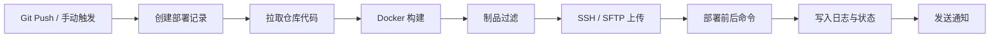
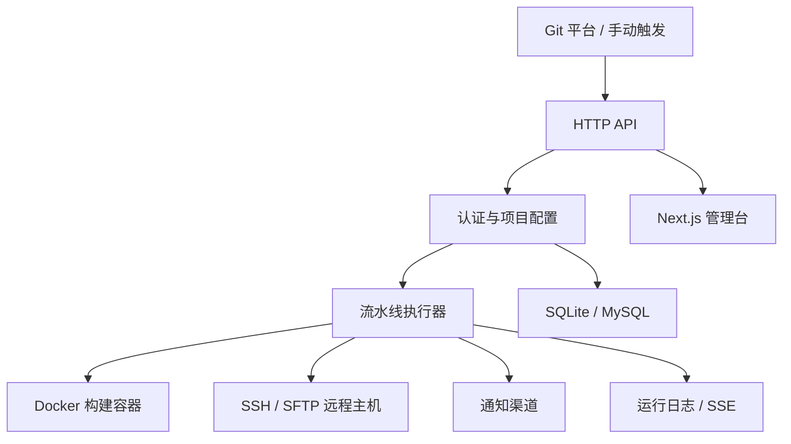

# 积木区 DevOps

[简体中文](./README.md) | [English](./README_EN.md)

> 🚀 轻量级 DevOps / CI/CD 部署系统，帮助中小团队把「代码提交 -> 构建 -> 上传 -> 远程部署 -> 日志追踪 -> 通知推送」串成一条顺滑、可观测、可复用的发布链路。


积木区 DevOps 面向中小团队、个人项目和内部交付场景，提供从 Git Webhook 触发，到 Docker 隔离构建、SSH / SFTP 分发、远程命令执行、部署日志查看、通知推送的一站式发布能力。

后端使用 Go 构建，前端管理台基于 Next.js。发布包和 Docker 镜像会先编译前端，再将静态资源嵌入后端程序中，因此默认只需要启动一个服务、访问一个端口 `18080`，即可直接打开管理台。

## 💡 GitHub About 推荐

`轻量级 DevOps / CI/CD 部署系统，支持 Git Webhook、Docker 隔离构建、SSH 发布、部署日志追踪与多渠道通知。`

## 📚 快速导航

- 项目亮点：轻量部署、自动化闭环、构建隔离、安全存储、多渠道通知
- 核心信息：功能概览、技术栈、系统截图、执行流程
- 上手入口：快速开始、环境变量、使用步骤、部署教程
- 运维说明：Webhook 配置、备份恢复、安全说明
- 开源协作：目录结构、参与贡献、License

## ✨ 为什么选择它

- 🪶 轻量易部署：支持单二进制运行和 Docker 部署，适合快速落地
- 🔁 自动化闭环：支持 Git Webhook、手动触发、构建、上传、部署、通知全流程
- 🐳 构建隔离：在 Docker 容器中执行构建命令，降低环境污染和依赖冲突
- 🔒 安全可控：JWT 鉴权，敏感字段使用 AES-GCM 加密存储
- 📡 多渠道通知：支持 Webhook、企业微信、钉钉、飞书、Email
- 📊 运维友好：首页统计、部署成功率、耗时趋势、日志详情一目了然

## 🎯 适用场景

- 小团队内部发布系统，替代过重的 CI/CD 平台
- 需要通过 SSH 将构建产物部署到 Linux 服务器的项目
- 希望在同一页面中管理项目、主机、日志、通知和系统设置的场景
- 希望使用 SQLite 快速落地，后续再切换到 MySQL 的场景

## 🧩 功能概览

- 📦 项目管理：仓库、分支、Git 认证、Webhook、构建与部署配置
- 🖥️ 主机管理：SSH 连接信息管理，敏感字段加密存储
- 📝 部署记录：查看每次部署的状态、耗时和日志详情
- 🔔 通知渠道：Webhook、企业微信、钉钉、飞书、Email，支持默认渠道
- ⚙️ 系统设置：镜像加速地址、代理地址、账户设置、日志保留、备份恢复
- 📈 首页统计：部署总数、成功率、平均耗时、项目排行、趋势图
- 🗄️ 数据存储：支持 SQLite 和 MySQL

## 🛠️ 技术栈

- 后端：Go 1.25、Chi、JWT、AES-GCM、SSH/SFTP、Docker
- 前端：Next.js 15、React 19、Tailwind CSS 4、Zustand、Sonner、dnd-kit、Recharts
- 数据库：SQLite / MySQL

## 🖼️ 系统截图

<table>
  <tr>
    <td align="center"><br>登录页</td>
    <td align="center"><br>首页统计</td>
    <td align="center"><br>主机管理</td>
    <td align="center"><br>项目管理</td>
  </tr>
  <tr>
    <td align="center"><br>通知渠道</td>
    <td align="center"><br>部署记录</td>
    <td align="center"><br>部署日志详情</td>
    <td align="center"><br>系统设置</td>
  </tr>
</table>

## 🔄 执行流程



## 🏛️ 系统架构



- 管理台和 API 由同一个后端服务统一提供
- 项目、主机、部署配置、通知渠道等数据存储在 SQLite 或 MySQL 中
- 流水线执行器负责拉取代码、调用 Docker 构建、上传制品并执行远程部署命令
- 运行日志支持实时查看，通知结果可通过多种渠道下发

## 📋 环境要求

- Go 1.25+
- Node.js 20+ 和 pnpm
- Docker
- 目标主机可通过 SSH 登录
- SQLite 或 MySQL 8.0+

## 🚀 快速开始

### 🐳 Docker 部署

直接使用 GitHub Container Registry 提供的镜像运行。

SQLite 示例：

```bash
docker run -d --name jimuqu-devops \
  -p 18080:18080 \
  -v $(pwd)/data:/app/data \
  -v /var/run/docker.sock:/var/run/docker.sock \
  -e APP_SECRET="jimuqu-devops-secret" \
  -e ADMIN_USERNAME="admin" \
  -e ADMIN_PASSWORD="admin123" \
  ghcr.io/chengliang4810/jimuqu-devops:latest
```

MySQL 示例：

```bash
docker run -d --name jimuqu-devops \
  -p 18080:18080 \
  -v $(pwd)/data:/app/data \
  -v /var/run/docker.sock:/var/run/docker.sock \
  -e APP_DB_DRIVER='mysql' \
  -e APP_DB_SOURCE='root:password@tcp(mysql:3306)/jimuqu_devops?charset=utf8mb4&parseTime=true&loc=Local' \
  -e APP_SECRET="jimuqu-devops-secret" \
  -e ADMIN_USERNAME="admin" \
  -e ADMIN_PASSWORD="admin123" \
  ghcr.io/chengliang4810/jimuqu-devops:latest
```

或使用 docker compose。

SQLite 的 `docker-compose.yml` 示例：

```yaml
services:
  app:
    image: ghcr.io/chengliang4810/jimuqu-devops:latest
    container_name: jimuqu-devops
    ports:
      - "18080:18080"
    environment:
      APP_SECRET: "jimuqu-devops-secret"
      ADMIN_USERNAME: "admin"
      ADMIN_PASSWORD: "admin123"
    volumes:
      - ./data:/app/data
      - /var/run/docker.sock:/var/run/docker.sock
    restart: unless-stopped
```

MySQL 的 `docker-compose.yml` 示例：

```yaml
services:
  app:
    image: ghcr.io/chengliang4810/jimuqu-devops:latest
    container_name: jimuqu-devops
    ports:
      - "18080:18080"
    environment:
      APP_DB_DRIVER: "mysql"
      APP_DB_SOURCE: "root:password@tcp(mysql:3306)/jimuqu_devops?charset=utf8mb4&parseTime=true&loc=Local"
      APP_SECRET: "jimuqu-devops-secret"
      ADMIN_USERNAME: "admin"
      ADMIN_PASSWORD: "admin123"
    volumes:
      - ./data:/app/data
      - /var/run/docker.sock:/var/run/docker.sock
    restart: unless-stopped
```

访问：

- 管理台：`http://127.0.0.1:18080`
- 健康检查：`http://127.0.0.1:18080/healthz`

说明：

- 容器内需要通过 `/var/run/docker.sock` 调用宿主机 Docker，才能执行项目构建
- 默认使用 SQLite，数据保存在挂载目录 `/app/data`
- 默认数据目录就是 `/app/data`，工作区默认就是 `/app/data/workspaces`，不需要额外配置
- `docker-compose.yml` 默认使用 `ghcr.io/chengliang4810/jimuqu-devops:latest`
- 示例中的管理员默认账号是 `admin / admin123`
- 示例中的 `APP_SECRET` 默认写成 `jimuqu-devops-secret`，生产环境建议替换

### 📦 Release 包运行

从 Releases 下载对应平台压缩包，解压后直接运行单个后端程序：

Linux / macOS：

```bash
./server
```

访问：

- 管理台：`http://127.0.0.1:18080`

如果需要指定数据库和监听端口，先设置环境变量再启动。例如 MySQL：

```bash
export APP_DB_DRIVER="mysql"
export APP_DB_SOURCE="root:password@tcp(127.0.0.1:3306)/jimuqu_devops?charset=utf8mb4&parseTime=true&loc=Local"
export APP_SECRET="jimuqu-devops-secret"
export ADMIN_USERNAME="admin"
export ADMIN_PASSWORD="admin123"
./server
```

SQLite：

```bash
export APP_SECRET="jimuqu-devops-secret"
export ADMIN_USERNAME="admin"
export ADMIN_PASSWORD="admin123"
./server
```

## 🔐 环境变量

| 变量 | 默认值 | 说明 |
| --- | --- | --- |
| `APP_ADDR` | `:18080` | 后端监听地址，不是对外访问 URL |
| `APP_DATA_DIR` | `./data` | 数据目录 |
| `APP_DB_DRIVER` | `sqlite` | 数据库驱动，支持 `sqlite` / `mysql` |
| `APP_DB_SOURCE` | `APP_DATA_DIR/pipeline.db` | SQLite 文件路径或 MySQL DSN；SQLite 默认跟随 `APP_DATA_DIR` |
| `APP_WORKSPACE_DIR` | `APP_DATA_DIR/workspaces` | 构建工作目录；通常不需要单独配置 |
| `APP_SECRET` | `change-me-in-production` | 统一密钥，同时用于 AES-GCM 加密和 JWT 签名 |
| `ADMIN_USERNAME` | `admin` | 初始管理员用户名 |
| `ADMIN_PASSWORD` | `admin123` | 初始管理员密码 |
| `NEXT_PUBLIC_API_BASE_URL` | 空 | 单独部署前端时可手动指定 API 地址 |

说明：

- `APP_ADDR` 只决定程序监听在哪个地址，例如 `:18080` 或 `127.0.0.1:18080`
- 用户最终访问哪个地址，取决于你是否放在 Nginx、反向代理或域名后面
- `APP_WORKSPACE_DIR` 未设置时会自动落到 `APP_DATA_DIR/workspaces`
- 制品临时目录固定在 `APP_DATA_DIR/artifacts`，不需要单独配置
- Docker 部署且挂载 `/var/run/docker.sock` 时，建议让宿主机和容器使用同一个 `APP_DATA_DIR` 绝对路径
- 发布包和 Docker 镜像会在构建时把前端资源嵌入到后端程序

## 🧭 使用步骤

1. 登录管理台。
2. 打开“设置”，先配置镜像加速地址和代理地址。
3. 添加主机，填写目标服务器的 SSH 地址、端口、账号和密码。
4. 创建通知渠道，可选设置一个默认渠道。
5. 创建项目，填写仓库地址、分支和描述。
6. 在项目中补充部署配置：
   - 选择主机
   - 选择构建镜像
   - 编写构建命令
   - 配置制品过滤规则
   - 配置远程保存目录和部署目录
   - 选择通知渠道
7. 复制项目 Webhook 地址并配置到 Git 平台。
8. 推送代码或手动触发部署。
9. 在“部署记录”中查看状态、日志和历史结果。
10. 定期在“设置”页面导出备份。

## 📘 使用说明

### 1. 🐳 镜像加速地址

- 支持配置多个地址
- 每行一个镜像加速地址
- 构建时会按顺序依次尝试

示例：

```text
mirror.ccs.tencentyun.com
docker.1ms.run
registry.cn-hangzhou.aliyuncs.com
```

### 2. 🌐 代理地址

- 只需要填写一个地址
- 系统会自动写入：
  - `HTTP_PROXY`
  - `HTTPS_PROXY`
  - `http_proxy`
  - `https_proxy`

示例：

```text
http://127.0.0.1:7890
```

### 3. 💾 备份与恢复

设置页支持：

- 下载 JSON 备份
- 导入 JSON 恢复

备份内容包括：

- 主机数据
- 项目数据
- 部署配置
- 通知渠道
- 系统设置

### 4. 👤 账户设置

设置页支持：

- 修改用户名
- 修改密码

### 5. 🧾 部署记录设置

设置页支持：

- 记录保存天数
- 一键清空部署记录

## 🔗 Webhook 配置

每个项目都会生成唯一的 Webhook 地址：

```text
POST /api/v1/webhooks/{token}
```

系统会自动从以下字段识别分支：

- `ref`
- `branch`
- Bitbucket 风格 `push.changes[0].new.name`
- 请求头 `X-Git-Ref`

## 🏗️ 部署教程

### 方案一：💻 本地开发

适合本地联调和日常开发：

1. 启动后端 `go run ./cmd/server`
2. 启动前端 `cd web-next && pnpm dev`
3. 浏览器访问 `http://127.0.0.1:3000`
4. 前端在开发模式下会自动把 `3000` 端口页面请求转到 `18080` 后端

### 方案二：🐳 Docker 部署

适合单机、测试环境和小型生产环境：

#### 1. ▶️ 启动容器

SQLite 示例：

```bash
docker run -d --name jimuqu-devops \
  -p 18080:18080 \
  -v $(pwd)/data:/app/data \
  -v /var/run/docker.sock:/var/run/docker.sock \
  -e APP_SECRET="jimuqu-devops-secret" \
  -e ADMIN_USERNAME="admin" \
  -e ADMIN_PASSWORD="admin123" \
  ghcr.io/chengliang4810/jimuqu-devops:latest
```

#### 2. 🌍 访问系统

- 管理台：`http://127.0.0.1:18080`
- 健康检查：`http://127.0.0.1:18080/healthz`

#### 3. 🗃️ 可选：切换 MySQL

MySQL 示例：

```bash
docker run -d --name jimuqu-devops \
  -p 18080:18080 \
  -v $(pwd)/data:/app/data \
  -v /var/run/docker.sock:/var/run/docker.sock \
  -e APP_DB_DRIVER=mysql \
  -e APP_DB_SOURCE='root:password@tcp(mysql:3306)/jimuqu_devops?charset=utf8mb4&parseTime=true&loc=Local' \
  -e APP_SECRET="jimuqu-devops-secret" \
  -e ADMIN_USERNAME="admin" \
  -e ADMIN_PASSWORD="admin123" \
  ghcr.io/chengliang4810/jimuqu-devops:latest
```

### 方案三：📦 Release 包部署

适合不使用 Docker 的主机：

#### 1. 📂 解压 Releases 压缩包

压缩包中包含：

```text
server / server.exe
README.md
```

#### 2. ▶️ 启动服务

Linux / macOS：

```bash
./server
```

#### 3. 🔀 反向代理

如果你需要绑定域名，可以把整个 `18080` 端口通过 Nginx 反代出去：

```nginx
server {
    listen 80;
    server_name devops.example.com;

    location / {
        proxy_pass http://127.0.0.1:18080;
        proxy_http_version 1.1;
        proxy_set_header Host $host;
        proxy_set_header X-Real-IP $remote_addr;
        proxy_set_header X-Forwarded-For $proxy_add_x_forwarded_for;
        proxy_set_header X-Forwarded-Proto $scheme;
        proxy_buffering off;
    }
}
```

## 🗂️ 目录结构

```text
cmd/server                 启动入口
internal/app               应用装配
internal/config            环境变量加载
internal/httpapi           HTTP API、认证中间件、SSE/日志流
internal/model             数据模型
internal/pipeline          构建与部署执行器
internal/store             SQLite / MySQL 存储实现
web-next                   当前主用管理端
docs/images                README 截图资源
scripts/build-release.sh   打包 release 资源包
.github/workflows          GitHub Actions 发布流程
```

## 🛣️ Roadmap

- [x] Git Webhook 触发部署
- [x] Docker 隔离构建
- [x] SSH / SFTP 上传与远程部署
- [x] 通知渠道管理与默认通知
- [x] SQLite / MySQL 存储支持
- [x] 前端管理台与首页统计看板
- [ ] 更细粒度的权限与多用户支持
- [ ] 更丰富的流水线步骤编排能力
- [ ] 更完整的系统监控与告警能力
- [ ] 更多部署目标与制品类型支持

## ❓ FAQ

### 这个项目适合谁？

适合需要快速搭建内部部署平台的小团队、个人项目维护者，以及希望用轻量方案替代复杂 CI/CD 系统的场景。

### 必须使用 Docker 吗？

运行服务本身不强制依赖 Docker，但如果你希望使用内置的构建能力，就需要让服务访问 Docker 环境。

### 可以不用 SQLite 吗？

可以，项目支持 SQLite 和 MySQL。默认使用 SQLite 以便快速启动，也可以切换到 MySQL 适配更稳定的持久化场景。

### 前端和后端必须分开部署吗？

不需要。默认发布包和 Docker 镜像会把前端静态资源嵌入后端，通常只启动一个服务即可。

### 支持哪些通知渠道？

当前支持 Webhook、企业微信、钉钉、飞书和 Email。

## 🤝 参与贡献

欢迎通过 Issue 和 Pull Request 一起完善这个项目。

本地开发建议：

```bash
# 后端
go run ./cmd/server

# 前端
cd web-next
pnpm install
pnpm dev
```

提交改动前建议至少执行：

```bash
go test ./...
cd web-next && pnpm build
```

## 🔐 安全说明

- SSH 密码、Git 凭据、通知 Token 使用 AES-GCM 加密存储
- 管理端使用 JWT 登录认证
- Webhook 使用项目独立 Token
- 后端只负责执行部署，目标主机仍建议最小权限配置

## 📄 License

本项目基于 MIT License 开源，详见 [LICENSE](./LICENSE)。

## 🌍 仓库地址

- GitHub：<https://github.com/chengliang4810/jimuqu-devops.git>
