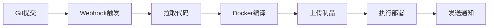

# 积木区 DevOps 流水线

> 🚀 **简单快捷**的轻量级CI/CD部署系统 - 一键配置，自动部署

## ✨ 核心特点

- **🎯 简单**：可视化界面，3步完成配置
- **⚡ 快捷**：Git webhook自动触发，无需人工干预
- **🔒 安全**：SSH密码AES加密，JWT认证登录
- **💪 强大**：Docker隔离编译，支持任意语言项目
- **📱 轻量**：单个二进制文件，无需依赖环境

## 🎯 适用场景

- **前端项目**：React、Vue、Angular等前端应用自动部署
- **后端服务**：Go、Node.js、Python等API服务部署
- **静态站点**：Hugo、Jekyll等静态站点发布
- **小程序开发**：小程序后端服务快速部署

## 🚀 快速开始

### 1. 下载运行

```bash
# 编译（首次使用）
go build -o server.exe ./cmd/server

# 启动服务
./server.exe
```

### 2. 打开管理界面

访问 http://127.0.0.1:18080

默认账号：
- 用户名：`admin`
- 密码：`admin123`

### 3. 三步完成配置

1. **添加主机**：配置目标服务器的SSH连接信息
2. **创建项目**：添加Git仓库，选择编译镜像和命令
3. **复制Webhook**：将webhook URL配置到Git仓库

### 4. 享受自动部署

每次Git提交后，系统自动：
1. 拉取最新代码
2. 在Docker容器中编译
3. 上传到目标服务器
4. 执行部署命令
5. 发送通知结果

## 🛠️ 核心功能

### 项目管理
- 支持Git仓库webhook触发
- 一键复制项目到不同分支
- 可视化编译和部署配置

### 主机管理
- SSH密码加密存储
- 支持多主机部署
- 批量部署管理

### 部署配置
- Docker容器隔离编译环境
- 灵活的编译命令配置
- 制品文件过滤（包含/排除）
- 部署前后自定义命令
- 版本回滚支持

### 通知渠道
- 部署成功/失败实时通知
- 支持企业微信、钉钉、飞书
- 自定义Webhook通知

## 📋 使用流程



## 🏗️ 技术架构

- **语言**：Go 1.25+
- **存储**：SQLite（单文件数据库）
- **认证**：JWT Token
- **容器**：Docker（编译隔离）
- **网络**：SSH/SFTP（文件传输）
- **路由**：Chi（HTTP框架）

## 📖 配置说明

### 环境变量

| 变量 | 默认值 | 说明 |
|------|--------|------|
| `APP_ADDR` | `:18080` | 服务监听地址 |
| `APP_DATA_DIR` | `./data` | 数据目录 |
| `APP_SECRET` | `change-me` | 加密密钥 |

### 目录结构

```
├── cmd/server          # 启动入口
├── internal/           # 核心代码
│   ├── app/           # 应用组装
│   ├── httpapi/       # HTTP API & 界面
│   ├── pipeline/      # 流水线执行
│   └── store/         # 数据存储
└── data/              # 运行数据（自动生成）
```

## 🔐 安全特性

- SSH密码AES-GCM加密存储
- JWT Token用户认证
- Webhook Token唯一性验证
- 敏感信息本地加密，不上传云端

## 🌟 实际应用场景

### 前端项目部署
```javascript
// 编译镜像：node:20
// 编译命令：
pnpm install
pnpm run build

// 制品过滤：包含 dist/ 目录
// 部署后命令：docker restart nginx
```

### 后端API部署
```bash
# 编译镜像：golang:1.21
# 编译命令：
go build -o app

# 制品过滤：包含可执行文件
# 部署后命令：systemctl restart myapp
```

### 静态站点发布
```bash
# 编译镜像：hugo:latest
# 编译命令：
hugo --minify

// 制品过滤：包含 public/ 目录
// 部署后命令：复制到web服务器目录
```

## 🤝 开源协议

MIT License - 自由使用、修改和分发

## 📞 技术支持

- **GitHub仓库**：https://github.com/chengliang4810/jimuqu-devops
- **在线演示**：http://127.0.0.1:18080

---

**让部署变得简单快捷** 🚀