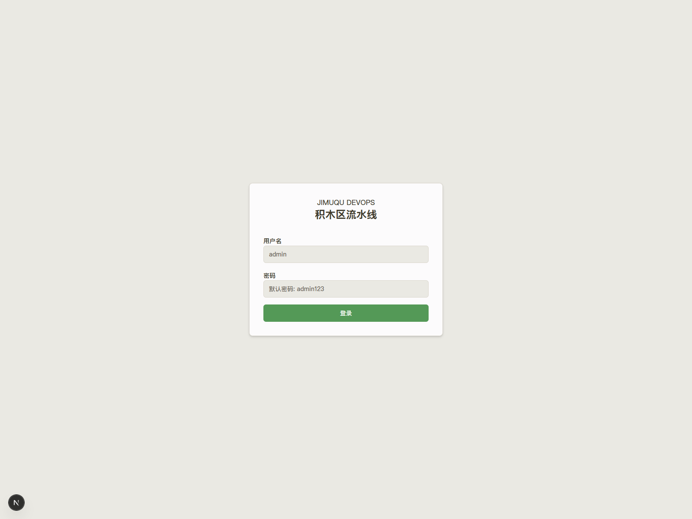
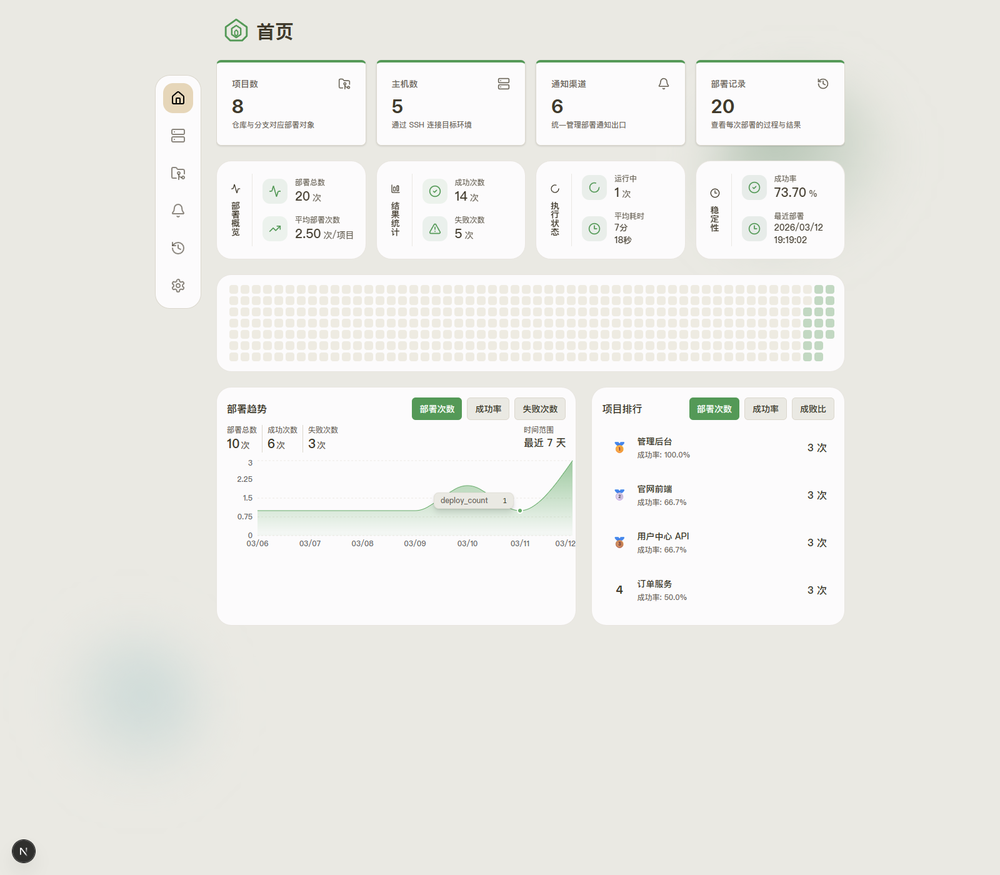
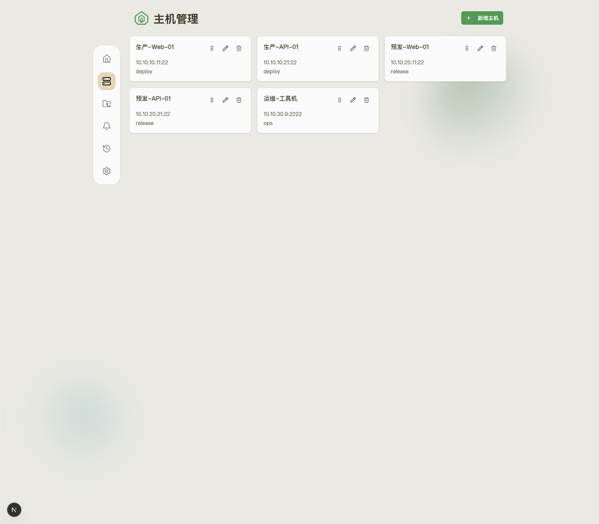
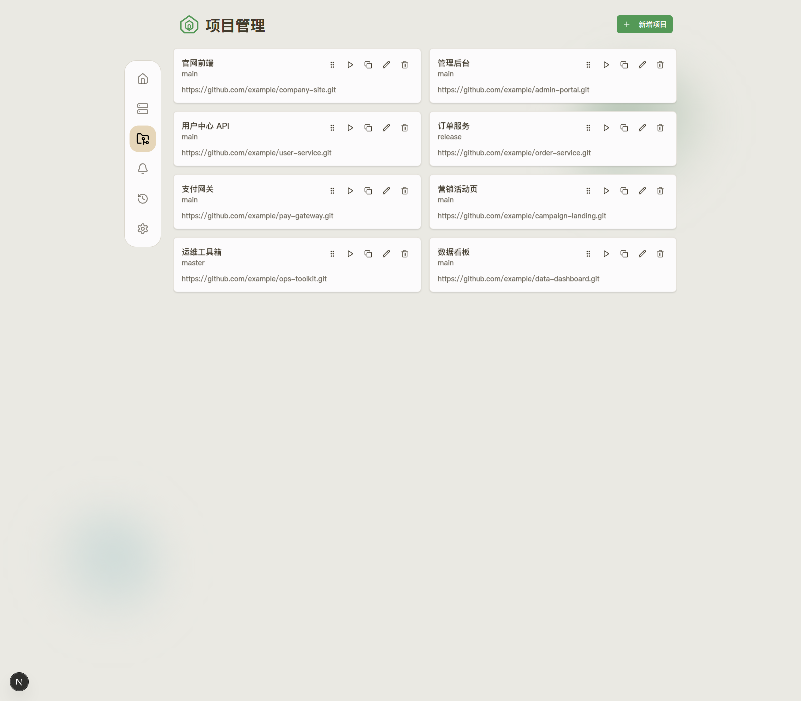
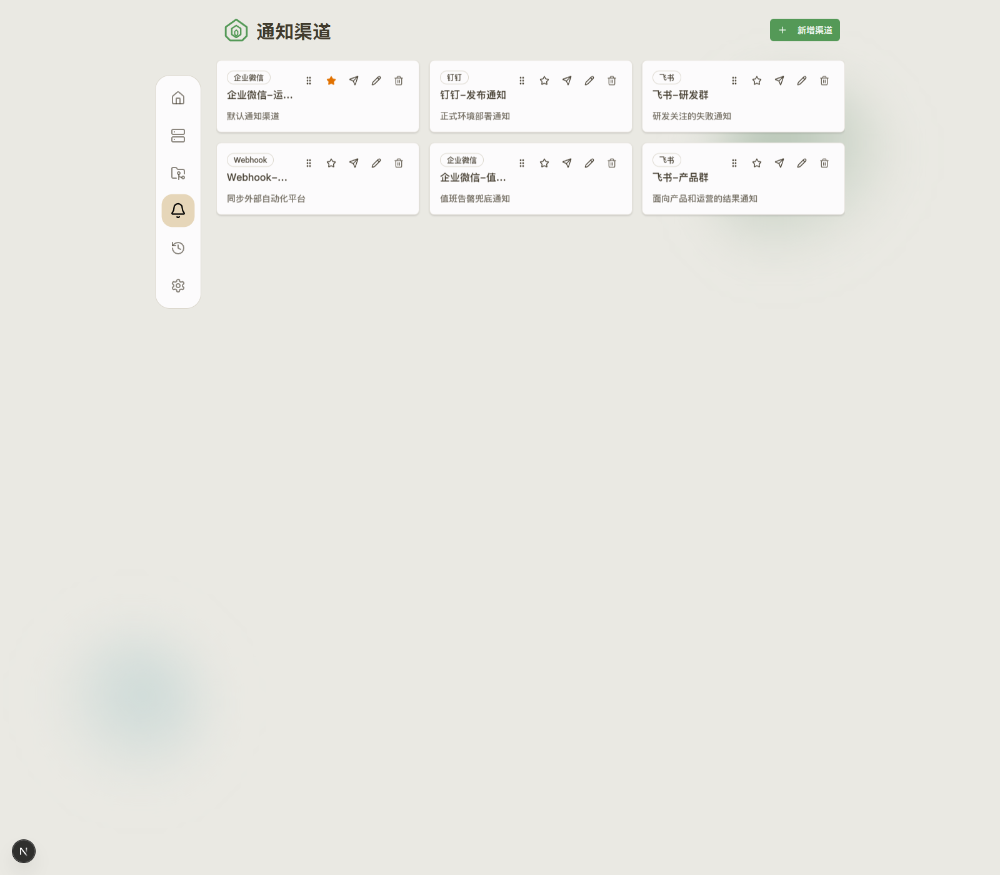
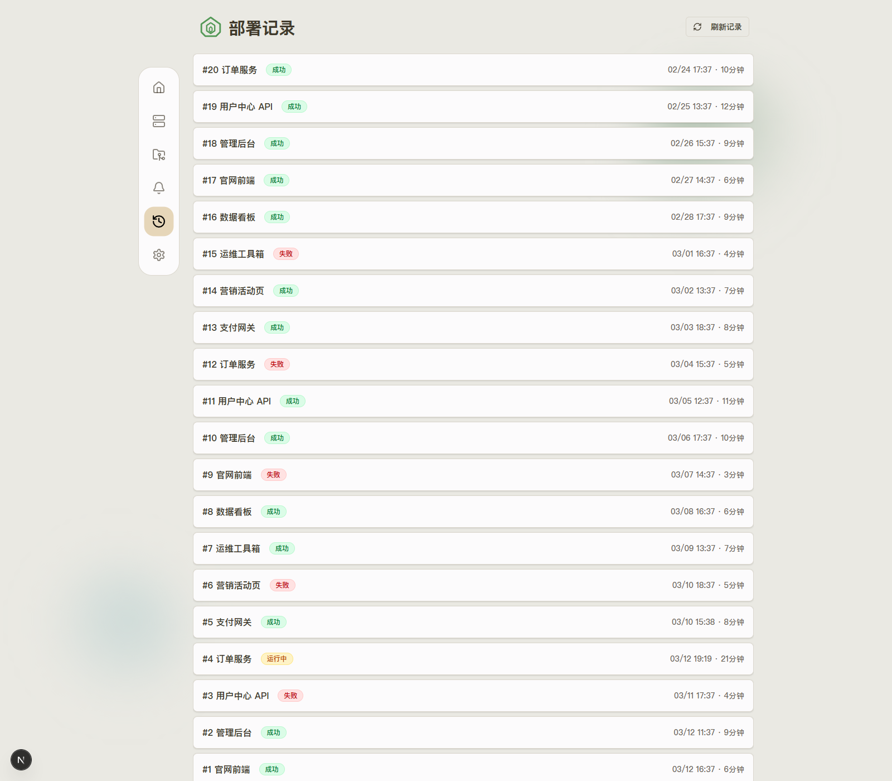
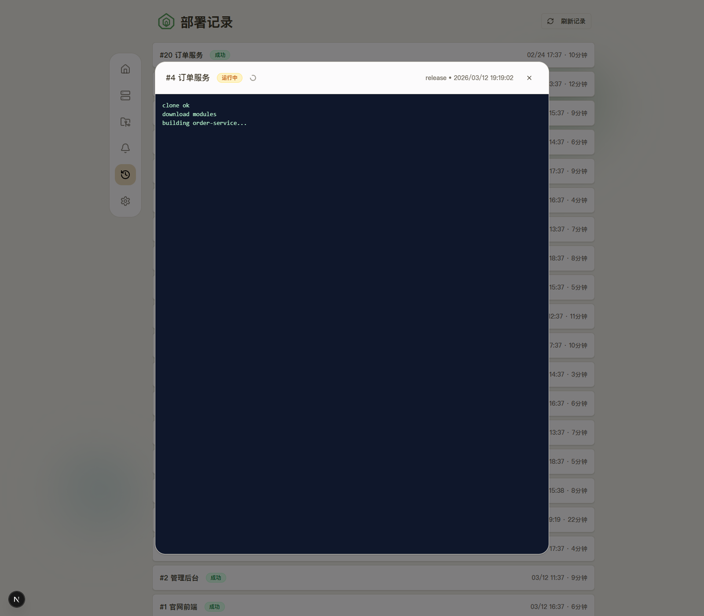
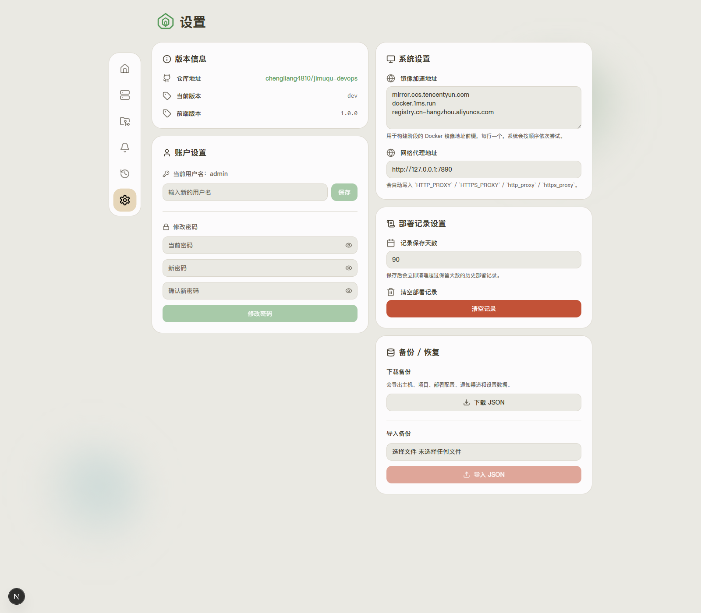
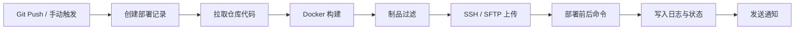

# 积木区 DevOps

轻量级 CI/CD 部署系统，面向中小团队的项目发布、主机分发和部署日志追踪场景。后端使用 Go，前端管理台使用 Next.js，支持 Git Webhook 触发、Docker 隔离构建、SSH 发布、通知渠道、备份恢复、系统设置和首页统计看板。

当前仓库同时保留了后端内置的旧版静态页面，以及 `web-next` 独立前端。本文档和截图均以当前主用的 `web-next` 管理端为准。

## 功能概览

- 项目管理：仓库、分支、Git 认证、Webhook、构建与部署配置
- 主机管理：SSH 连接信息管理，敏感字段加密存储
- 部署记录：查看每次部署的状态、耗时和日志详情
- 通知渠道：Webhook、企业微信、钉钉、飞书，支持默认渠道
- 系统设置：镜像加速地址、代理地址、账户设置、日志保留、备份恢复
- 首页统计：部署总数、成功率、平均耗时、项目排行、趋势图
- 数据存储：支持 SQLite 和 MySQL

## 技术栈

- 后端：Go 1.25、Chi、JWT、AES-GCM、SSH/SFTP、Docker
- 前端：Next.js 15、React 19、Tailwind CSS 4、Zustand、Sonner、dnd-kit、Recharts
- 数据库：SQLite / MySQL

## 系统截图

### 登录页



### 首页统计



### 主机管理



### 项目管理



### 通知渠道



### 部署记录



### 部署日志详情



### 系统设置



## 执行流程



## 环境要求

- Go 1.25+
- Node.js 20+ 和 pnpm
- Docker
- 目标主机可通过 SSH 登录
- SQLite 或 MySQL 8.0+

## 快速开始

### 1. 启动后端

SQLite 示例：

```powershell
$env:APP_ADDR=":18080"
$env:APP_DATA_DIR="./data"
$env:APP_DB_DRIVER="sqlite"
$env:APP_DB_SOURCE="./data/pipeline.db"
$env:APP_WORKSPACE_DIR="./data/workspaces"
$env:APP_ARTIFACT_DIR="./data/artifacts"
$env:APP_SECRET="change-me-in-production"
$env:JWT_SECRET="change-me-in-production"
$env:ADMIN_USERNAME="admin"
$env:ADMIN_PASSWORD="admin123"

go run ./cmd/server
```

MySQL 示例：

```powershell
$env:APP_ADDR=":18080"
$env:APP_DATA_DIR="./data"
$env:APP_DB_DRIVER="mysql"
$env:APP_DB_SOURCE="root:password@tcp(127.0.0.1:3306)/jimuqu_devops?charset=utf8mb4&parseTime=true&loc=Local"
$env:APP_WORKSPACE_DIR="./data/workspaces"
$env:APP_ARTIFACT_DIR="./data/artifacts"
$env:APP_SECRET="change-me-in-production"
$env:JWT_SECRET="change-me-in-production"
$env:ADMIN_USERNAME="admin"
$env:ADMIN_PASSWORD="admin123"

go run ./cmd/server
```

健康检查：

```powershell
curl http://127.0.0.1:18080/healthz
```

### 2. 启动前端

```powershell
cd web-next
pnpm install
pnpm dev
```

打开：

- 前端管理台：`http://127.0.0.1:3000`
- 后端 API：`http://127.0.0.1:18080`

默认账号：

- 用户名：`admin`
- 密码：`admin123`

## 环境变量

| 变量 | 默认值 | 说明 |
| --- | --- | --- |
| `APP_ADDR` | `:18080` | 后端监听地址 |
| `APP_DATA_DIR` | `./data` | 数据目录 |
| `APP_DB_DRIVER` | `sqlite` | 数据库驱动，支持 `sqlite` / `mysql` |
| `APP_DB_SOURCE` | `./data/pipeline.db` | SQLite 文件路径或 MySQL DSN |
| `APP_WORKSPACE_DIR` | `./data/workspaces` | 构建工作目录 |
| `APP_ARTIFACT_DIR` | `./data/artifacts` | 制品暂存目录 |
| `APP_SECRET` | `change-me-in-production` | AES 加密密钥 |
| `JWT_SECRET` | `change-me-in-production` | JWT 签名密钥 |
| `ADMIN_USERNAME` | `admin` | 初始管理员用户名 |
| `ADMIN_PASSWORD` | `admin123` | 初始管理员密码 |
| `NEXT_PUBLIC_API_BASE_URL` | 空 | 前端在生产环境下可手动指定 API 地址 |

## 使用步骤

1. 登录管理台。
2. 打开“设置”，先配置镜像加速地址和代理地址。
3. 添加主机，填写目标服务器的 SSH 地址、端口、账号和密码。
4. 创建通知渠道，可选设置一个默认渠道。
5. 创建项目，填写仓库地址、分支和描述。
6. 在项目中补充部署配置：
   - 选择主机
   - 选择构建镜像
   - 编写构建命令
   - 配置制品过滤规则
   - 配置远程保存目录和部署目录
   - 选择通知渠道
7. 复制项目 Webhook 地址并配置到 Git 平台。
8. 推送代码或手动触发部署。
9. 在“部署记录”中查看状态、日志和历史结果。
10. 定期在“设置”页面导出备份。

## 使用说明

### 1. 镜像加速地址

- 支持配置多个地址
- 每行一个镜像加速地址
- 构建时会按顺序依次尝试

示例：

```text
mirror.ccs.tencentyun.com
docker.1ms.run
registry.cn-hangzhou.aliyuncs.com
```

### 2. 代理地址

- 只需要填写一个地址
- 系统会自动写入：
  - `HTTP_PROXY`
  - `HTTPS_PROXY`
  - `http_proxy`
  - `https_proxy`

示例：

```text
http://127.0.0.1:7890
```

### 3. 备份与恢复

设置页支持：

- 下载 JSON 备份
- 导入 JSON 恢复

备份内容包括：

- 主机数据
- 项目数据
- 部署配置
- 通知渠道
- 系统设置

### 4. 账户设置

设置页支持：

- 修改用户名
- 修改密码

### 5. 部署记录设置

设置页支持：

- 记录保存天数
- 一键清空部署记录

## Webhook 配置

每个项目都会生成唯一的 Webhook 地址：

```text
POST /api/v1/webhooks/{token}
```

系统会自动从以下字段识别分支：

- `ref`
- `branch`
- Bitbucket 风格 `push.changes[0].new.name`
- 请求头 `X-Git-Ref`

## 部署教程

### 方案一：本地开发

适合本地联调和日常开发：

1. 启动后端 `go run ./cmd/server`
2. 启动前端 `cd web-next && pnpm dev`
3. 浏览器访问 `http://127.0.0.1:3000`
4. 前端在开发模式下会自动把 `3000` 端口页面请求转到 `18080` 后端

### 方案二：生产部署

适合单机或云服务器部署：

#### 1. 构建后端

```powershell
go build -o server.exe ./cmd/server
```

#### 2. 构建前端静态文件

```powershell
cd web-next
pnpm install
pnpm build
```

构建成功后，静态文件输出到：

```text
web-next/out
```

#### 3. 启动后端服务

```powershell
$env:APP_DB_DRIVER="mysql"
$env:APP_DB_SOURCE="root:password@tcp(127.0.0.1:3306)/jimuqu_devops?charset=utf8mb4&parseTime=true&loc=Local"
.\server.exe
```

#### 4. 使用 Nginx 托管前端并代理 API

```nginx
server {
    listen 80;
    server_name devops.example.com;

    root /opt/jimuqu-devops/web-next/out;
    index index.html;

    location / {
        try_files $uri $uri/ /index.html;
    }

    location /api/v1/ {
        proxy_pass http://127.0.0.1:18080/api/v1/;
        proxy_http_version 1.1;
        proxy_set_header Host $host;
        proxy_set_header X-Real-IP $remote_addr;
        proxy_set_header X-Forwarded-For $proxy_add_x_forwarded_for;
        proxy_set_header X-Forwarded-Proto $scheme;
        proxy_buffering off;
    }

    location /healthz {
        proxy_pass http://127.0.0.1:18080/healthz;
        proxy_set_header Host $host;
    }
}
```

如果前端和后端不是同域部署，可以在前端构建前设置：

```powershell
$env:NEXT_PUBLIC_API_BASE_URL="https://api.example.com"
pnpm build
```

## 目录结构

```text
cmd/server                 启动入口
internal/app               应用装配
internal/config            环境变量加载
internal/httpapi           HTTP API 与旧版内置页面
internal/model             数据模型
internal/pipeline          构建与部署执行器
internal/store             SQLite / MySQL 存储实现
web-next                   当前主用管理端
docs/images                README 截图资源
```

## 安全说明

- SSH 密码、Git 凭据、通知 Token 使用 AES-GCM 加密存储
- 管理端使用 JWT 登录认证
- Webhook 使用项目独立 Token
- 后端只负责执行部署，目标主机仍建议最小权限配置

## 仓库地址

- GitHub：<https://github.com/chengliang4810/jimuqu-devops.git>

