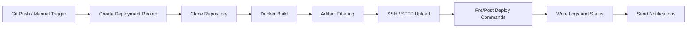
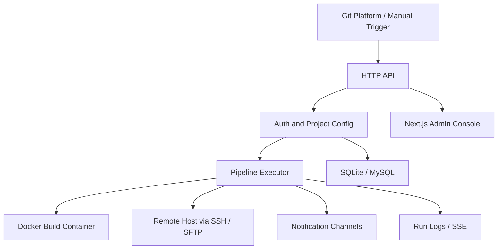

# Jimuqu DevOps

[简体中文](./README.md) | [English](./README_EN.md)

> 🚀 A lightweight DevOps / CI/CD deployment platform that helps small and mid-sized teams turn "code push -> build -> upload -> remote deploy -> log tracking -> notification delivery" into one smooth, observable, and reusable release workflow.


Jimuqu DevOps is designed for small and mid-sized teams, personal projects, and internal delivery workflows. It provides an all-in-one release experience, from Git webhook triggers to Docker-isolated builds, SSH / SFTP artifact delivery, remote command execution, deployment log streaming, and notifications.

The backend is written in Go, and the admin console is built with Next.js. Release packages and Docker images compile the frontend first, then embed the static assets into the backend binary. In most cases, you only need to start one service and open port `18080` to access the admin UI.

## 💡 Recommended GitHub About

`Lightweight DevOps / CI/CD platform with Git webhook triggers, Docker-isolated builds, SSH deployment, run logs, and multi-channel notifications.`

## 📚 Quick Navigation

- Highlights: lightweight deployment, automated workflow, isolated builds, secure storage, multi-channel notifications
- Core sections: features, tech stack, screenshots, workflow
- Getting started: quick start, environment variables, setup steps, deployment guide
- Operations: webhook configuration, backup/restore, security notes
- Open source collaboration: project structure, contributing, license

## ✨ Why Use It

- 🪶 Lightweight and easy to deploy: supports both single-binary and Docker-based deployment
- 🔁 End-to-end automation: covers Git webhook triggers, manual runs, builds, uploads, deployments, and notifications
- 🐳 Isolated builds: executes build commands inside Docker containers to reduce environment drift and dependency conflicts
- 🔒 Security-minded: JWT authentication with AES-GCM encryption for sensitive fields
- 📡 Multi-channel notifications: supports Webhook, WeCom, DingTalk, Feishu, and Email
- 📊 Ops-friendly: dashboard metrics, success rate, duration trends, and full log details in one place

## 🎯 Good Fit For

- Small teams that want an internal deployment platform without adopting a heavy CI/CD suite
- Projects that deploy build artifacts to Linux servers over SSH
- Teams that want projects, hosts, logs, notifications, and settings in a single admin console
- Setups that want to start quickly with SQLite and later move to MySQL

## 🧩 Features

- 📦 Project management: repository, branch, Git credentials, webhook, build, and deployment settings
- 🖥️ Host management: SSH connection management with encrypted sensitive fields
- 📝 Deployment history: inspect status, duration, and detailed logs for every run
- 🔔 Notification channels: Webhook, WeCom, DingTalk, Feishu, and Email, with default channel support
- ⚙️ System settings: registry mirrors, proxy, account settings, log retention, backup, and restore
- 📈 Dashboard analytics: total deployments, success rate, average duration, top projects, and trend charts
- 🗄️ Data storage: supports both SQLite and MySQL

## 🛠️ Tech Stack

- Backend: Go 1.25, Chi, JWT, AES-GCM, SSH/SFTP, Docker
- Frontend: Next.js 15, React 19, Tailwind CSS 4, Zustand, Sonner, dnd-kit, Recharts
- Database: SQLite / MySQL

## 🖼️ Screenshots

<table>
  <tr>
    <td align="center"><br>Login</td>
    <td align="center"><br>Dashboard</td>
    <td align="center"><br>Hosts</td>
    <td align="center"><br>Projects</td>
  </tr>
  <tr>
    <td align="center"><br>Notifications</td>
    <td align="center"><br>Runs</td>
    <td align="center"><br>Run Detail</td>
    <td align="center"><br>Settings</td>
  </tr>
</table>

## 🔄 Workflow



## 🏛️ Architecture



- The admin UI and API are served by the same backend process
- Projects, hosts, deployment configs, and notification channels are stored in SQLite or MySQL
- The pipeline executor clones code, runs builds in Docker, uploads artifacts, and executes remote deployment commands
- Run logs can be streamed in real time, and notifications are delivered through multiple channels

## 📋 Requirements

- Go 1.25+
- Node.js 20+ and pnpm
- Docker
- Target hosts accessible over SSH
- SQLite or MySQL 8.0+

## 🚀 Quick Start

### 🐳 Docker Deployment

Run the prebuilt image from GitHub Container Registry.

SQLite example:

```bash
docker run -d --name jimuqu-devops \
  -p 18080:18080 \
  -v $(pwd)/data:/app/data \
  -v /var/run/docker.sock:/var/run/docker.sock \
  -e APP_SECRET="jimuqu-devops-secret" \
  -e ADMIN_USERNAME="admin" \
  -e ADMIN_PASSWORD="admin123" \
  ghcr.io/chengliang4810/jimuqu-devops:latest
```

MySQL example:

```bash
docker run -d --name jimuqu-devops \
  -p 18080:18080 \
  -v $(pwd)/data:/app/data \
  -v /var/run/docker.sock:/var/run/docker.sock \
  -e APP_DB_DRIVER='mysql' \
  -e APP_DB_SOURCE='root:password@tcp(mysql:3306)/jimuqu_devops?charset=utf8mb4&parseTime=true&loc=Local' \
  -e APP_SECRET="jimuqu-devops-secret" \
  -e ADMIN_USERNAME="admin" \
  -e ADMIN_PASSWORD="admin123" \
  ghcr.io/chengliang4810/jimuqu-devops:latest
```

Or use `docker compose`.

SQLite `docker-compose.yml` example:

```yaml
services:
  app:
    image: ghcr.io/chengliang4810/jimuqu-devops:latest
    container_name: jimuqu-devops
    ports:
      - "18080:18080"
    environment:
      APP_SECRET: "jimuqu-devops-secret"
      ADMIN_USERNAME: "admin"
      ADMIN_PASSWORD: "admin123"
    volumes:
      - ./data:/app/data
      - /var/run/docker.sock:/var/run/docker.sock
    restart: unless-stopped
```

MySQL `docker-compose.yml` example:

```yaml
services:
  app:
    image: ghcr.io/chengliang4810/jimuqu-devops:latest
    container_name: jimuqu-devops
    ports:
      - "18080:18080"
    environment:
      APP_DB_DRIVER: "mysql"
      APP_DB_SOURCE: "root:password@tcp(mysql:3306)/jimuqu_devops?charset=utf8mb4&parseTime=true&loc=Local"
      APP_SECRET: "jimuqu-devops-secret"
      ADMIN_USERNAME: "admin"
      ADMIN_PASSWORD: "admin123"
    volumes:
      - ./data:/app/data
      - /var/run/docker.sock:/var/run/docker.sock
    restart: unless-stopped
```

Access:

- Admin UI: `http://127.0.0.1:18080`
- Health check: `http://127.0.0.1:18080/healthz`

Notes:

- The container needs `/var/run/docker.sock` to access the host Docker daemon for builds
- SQLite is used by default, with data stored under `/app/data`
- The default data directory is `/app/data`, and the workspace defaults to `/app/data/workspaces`
- The sample `docker-compose.yml` uses `ghcr.io/chengliang4810/jimuqu-devops:latest`
- The default admin credentials in the examples are `admin / admin123`
- Replace `APP_SECRET="jimuqu-devops-secret"` before using it in production

### 📦 Run from Release Package

Download the archive for your platform from Releases, extract it, and run the backend binary directly.

Linux / macOS:

```bash
./server
```

Access:

- Admin UI: `http://127.0.0.1:18080`

If you need a custom database or listening address, set environment variables before starting the service. Example for MySQL:

```bash
export APP_DB_DRIVER="mysql"
export APP_DB_SOURCE="root:password@tcp(127.0.0.1:3306)/jimuqu_devops?charset=utf8mb4&parseTime=true&loc=Local"
export APP_SECRET="jimuqu-devops-secret"
export ADMIN_USERNAME="admin"
export ADMIN_PASSWORD="admin123"
./server
```

SQLite:

```bash
export APP_SECRET="jimuqu-devops-secret"
export ADMIN_USERNAME="admin"
export ADMIN_PASSWORD="admin123"
./server
```

## 🔐 Environment Variables

| Variable | Default | Description |
| --- | --- | --- |
| `APP_ADDR` | `:18080` | Backend listen address, not the public access URL |
| `APP_DATA_DIR` | `./data` | Data directory |
| `APP_DB_DRIVER` | `sqlite` | Database driver, supports `sqlite` / `mysql` |
| `APP_DB_SOURCE` | `APP_DATA_DIR/pipeline.db` | SQLite file path or MySQL DSN; SQLite follows `APP_DATA_DIR` by default |
| `APP_WORKSPACE_DIR` | `APP_DATA_DIR/workspaces` | Build workspace directory; usually no need to override |
| `APP_SECRET` | `change-me-in-production` | Shared secret used for both AES-GCM encryption and JWT signing |
| `ADMIN_USERNAME` | `admin` | Initial admin username |
| `ADMIN_PASSWORD` | `admin123` | Initial admin password |
| `NEXT_PUBLIC_API_BASE_URL` | empty | Optional API base URL when frontend and backend are deployed separately |

Notes:

- `APP_ADDR` only controls where the server listens, such as `:18080` or `127.0.0.1:18080`
- The final URL users access depends on whether you place it behind Nginx, a reverse proxy, or a domain
- If `APP_WORKSPACE_DIR` is not set, it defaults to `APP_DATA_DIR/workspaces`
- Artifact temp files are stored under `APP_DATA_DIR/artifacts`
- When using Docker with `/var/run/docker.sock`, it is best for the host and container to share the same absolute `APP_DATA_DIR`
- Release packages and Docker images embed the frontend assets into the backend binary during build time

## 🧭 Getting Started

1. Sign in to the admin console.
2. Open "Settings" and configure registry mirrors and proxy settings first.
3. Add a host with its SSH address, port, username, and password.
4. Create a notification channel, optionally setting one as the default.
5. Create a project with repository URL, branch, and description.
6. Complete the deployment configuration for the project:
   - Select the host
   - Choose the build image
   - Write the build command
   - Configure artifact filtering rules
   - Configure the remote artifact directory and deployment directory
   - Choose notification channels
7. Copy the project's webhook URL and configure it on your Git platform.
8. Push code or trigger a deployment manually.
9. View status, logs, and history in "Deployment Records".
10. Export backups regularly from the "Settings" page.

## 📘 Usage Notes

### 1. 🐳 Registry Mirrors

- Multiple addresses are supported
- One mirror per line
- Mirrors are tried in order during builds

Example:

```text
mirror.ccs.tencentyun.com
docker.1ms.run
registry.cn-hangzhou.aliyuncs.com
```

### 2. 🌐 Proxy Address

- Only one address is needed
- The system automatically populates:
  - `HTTP_PROXY`
  - `HTTPS_PROXY`
  - `http_proxy`
  - `https_proxy`

Example:

```text
http://127.0.0.1:7890
```

### 3. 💾 Backup and Restore

Supported in the settings page:

- Download JSON backups
- Import JSON backups for restore

Backups include:

- Hosts
- Projects
- Deployment configurations
- Notification channels
- System settings

### 4. 👤 Account Settings

Supported in the settings page:

- Change username
- Change password

### 5. 🧾 Deployment Record Retention

Supported in the settings page:

- Set retention days
- Clear all deployment records with one click

## 🔗 Webhook Configuration

Each project gets a unique webhook endpoint:

```text
POST /api/v1/webhooks/{token}
```

The system automatically detects the branch from:

- `ref`
- `branch`
- Bitbucket-style `push.changes[0].new.name`
- `X-Git-Ref` request header

## 🏗️ Deployment Guide

### Option 1: 💻 Local Development

Recommended for local development and integration testing:

1. Start the backend with `go run ./cmd/server`
2. Start the frontend with `cd web-next && pnpm dev`
3. Open `http://127.0.0.1:3000` in your browser
4. In development mode, the frontend proxies requests to the backend on port `18080`

### Option 2: 🐳 Docker Deployment

Recommended for single-host setups, staging, and small production environments:

#### 1. ▶️ Start the Container

SQLite example:

```bash
docker run -d --name jimuqu-devops \
  -p 18080:18080 \
  -v $(pwd)/data:/app/data \
  -v /var/run/docker.sock:/var/run/docker.sock \
  -e APP_SECRET="jimuqu-devops-secret" \
  -e ADMIN_USERNAME="admin" \
  -e ADMIN_PASSWORD="admin123" \
  ghcr.io/chengliang4810/jimuqu-devops:latest
```

#### 2. 🌍 Access the System

- Admin UI: `http://127.0.0.1:18080`
- Health check: `http://127.0.0.1:18080/healthz`

#### 3. 🗃️ Optional: Switch to MySQL

MySQL example:

```bash
docker run -d --name jimuqu-devops \
  -p 18080:18080 \
  -v $(pwd)/data:/app/data \
  -v /var/run/docker.sock:/var/run/docker.sock \
  -e APP_DB_DRIVER=mysql \
  -e APP_DB_SOURCE='root:password@tcp(mysql:3306)/jimuqu_devops?charset=utf8mb4&parseTime=true&loc=Local' \
  -e APP_SECRET="jimuqu-devops-secret" \
  -e ADMIN_USERNAME="admin" \
  -e ADMIN_PASSWORD="admin123" \
  ghcr.io/chengliang4810/jimuqu-devops:latest
```

### Option 3: 📦 Release Package Deployment

Recommended for hosts where Docker is not used:

#### 1. 📂 Extract the Releases Archive

The package contains:

```text
server / server.exe
README.md
```

#### 2. ▶️ Start the Service

Linux / macOS:

```bash
./server
```

#### 3. 🔀 Reverse Proxy

If you want to bind a domain, proxy the entire `18080` port through Nginx:

```nginx
server {
    listen 80;
    server_name devops.example.com;

    location / {
        proxy_pass http://127.0.0.1:18080;
        proxy_http_version 1.1;
        proxy_set_header Host $host;
        proxy_set_header X-Real-IP $remote_addr;
        proxy_set_header X-Forwarded-For $proxy_add_x_forwarded_for;
        proxy_set_header X-Forwarded-Proto $scheme;
        proxy_buffering off;
    }
}
```

## 🗂️ Project Structure

```text
cmd/server                 entry point
internal/app               application wiring
internal/config            environment loading
internal/httpapi           HTTP API, auth middleware, SSE/log streaming
internal/model             data models
internal/pipeline          build and deployment executor
internal/store             SQLite / MySQL storage implementation
web-next                   main admin frontend
docs/images                README screenshot assets
scripts/build-release.sh   release packaging script
.github/workflows          GitHub Actions release workflows
```

## 🛣️ Roadmap

- [x] Git webhook-based deployment triggers
- [x] Docker-isolated builds
- [x] SSH / SFTP uploads and remote deployment
- [x] Notification channel management with default notifications
- [x] SQLite / MySQL storage support
- [x] Admin console with dashboard analytics
- [ ] More fine-grained permissions and multi-user support
- [ ] Richer pipeline step orchestration
- [ ] More complete system monitoring and alerting
- [ ] Support for more deployment targets and artifact types

## ❓ FAQ

### Who is this project for?

It is a good fit for small teams, solo maintainers, and internal platforms that want a lightweight deployment solution instead of a heavyweight CI/CD stack.

### Is Docker required?

Docker is not strictly required to run the service itself, but it is needed if you want to use the built-in isolated build capability.

### Can I use something other than SQLite?

Yes. The project supports both SQLite and MySQL. SQLite is the default for fast setup, while MySQL is available for more persistent production-style deployments.

### Do the frontend and backend need to be deployed separately?

No. By default, release packages and Docker images embed the frontend assets into the backend, so one service is usually enough.

### Which notification channels are supported?

Webhook, WeCom, DingTalk, Feishu, and Email are currently supported.

## 🤝 Contributing

Issues and Pull Requests are welcome.

Recommended local development workflow:

```bash
# backend
go run ./cmd/server

# frontend
cd web-next
pnpm install
pnpm dev
```

Before submitting changes, it is recommended to run:

```bash
go test ./...
cd web-next && pnpm build
```

## 🔐 Security Notes

- SSH passwords, Git credentials, and notification tokens are encrypted with AES-GCM before storage
- The admin UI uses JWT-based authentication
- Each project has an independent webhook token
- The backend only executes deployments; target hosts should still follow least-privilege principles

## 📄 License

This project is released under the MIT License. See [LICENSE](./LICENSE) for details.

## 🌍 Repository

- GitHub: <https://github.com/chengliang4810/jimuqu-devops.git>
